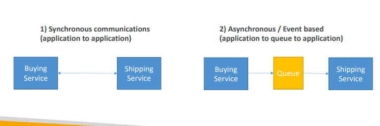
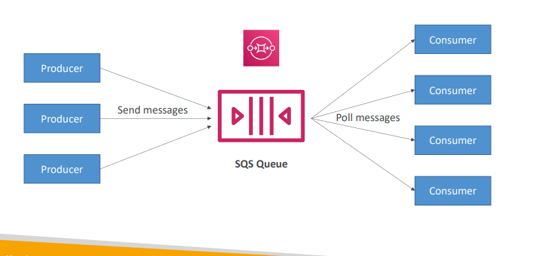
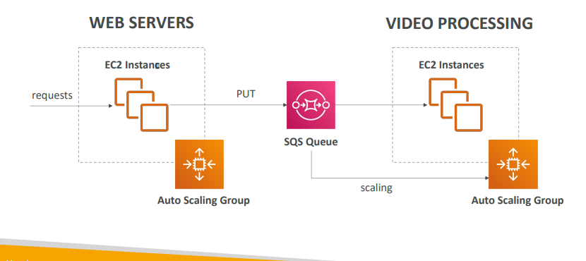
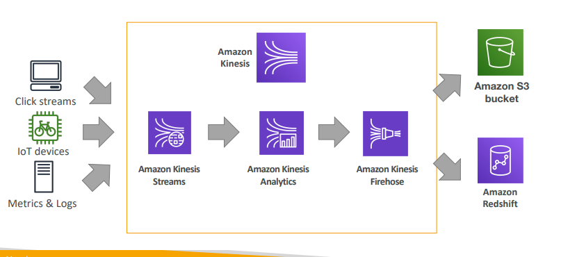
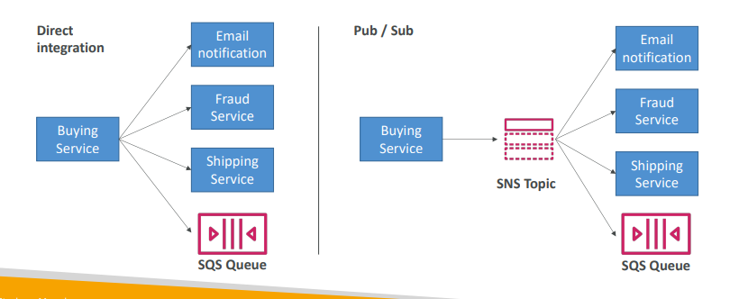

# Cloud intergrations

- When we start deploying multiple applications, they will inevitably need to communicate with one another
- There are two patterns of application communication
1. Synchronous communications
2. Asynchronous / Event based

- Synchronous between applications can be problematic if there are sudden spikes of traffic
- What if you need to suddenly encode 1000 videos but usually it’s 10?
- In that case, it’s better to decouple your applications:
  - using SQS: queue model
  - using SNS: pub/sub model
  - using Kinesis: real-time data streaming model
- These services can scale independently from our application!

## SQS - Simple Queue Service

- Oldest AWS offering (over 10 years old)
- Fully managed service (~serverless), use to **decouple** applications
- Scales from 1 message per second to 10,000s per second
- Default retention of messages: 4 days, maximum of 14 days
- No limit to how many messages can be in the queue
- **Messages are deleted after they’re read by consumers**
- Low latency (<10 ms on publish and receive)
- **Consumers share the work to read messages & scale horizontally**

## SQS to decouple between application tiers

## Amazon Kinesis
- For the exam: Kinesis = real-time big data streaming
- **Managed service to collect, process, and analyze real-time streaming data at any scale**

- Too detailed for the Cloud Practitioner exam but good to know:
  - Kinesis Data Streams: low latency streaming to ingest data at scale from
  hundreds of thousands of sources
  - Kinesis Data Firehose: load streams into S3, Redshift, ElasticSearch, etc…
  - Kinesis Data Analytics: perform real-time analytics on streams using SQL
  - Kinesis Video Streams: monitor real-time video streams for analytics or ML

## Amazon SNS
- What if you want to send one message to many receivers?

## SNS
- The “event publishers” only sends message to one SNS topic
- As many “event **subscribers**” as we want to listen to the SNS topic notifications
- Each subscriber to the topic **will get all the messages**
- Up to 12,500,000 subscriptions per topic, 100,000 topics limit

## Amazon MQ
- ****Only using if the company just migrates to the cloud , and use open protocols such as: : MQTT, AMQP, STOMP, Openwire, WSS**
- SQS, SNS are “cloud-native” services, and they’re using proprietary protocols from AWS
- When migrating to the cloud, instead of re-engineering the application to use SQS and SNS, we can use Amazon MQ
- Amazon MQ = managed Apache ActiveMQ
- Amazon MQ doesn’t “scale” as much as SQS / SNS
- Amazon MQ runs on a dedicated machine (not serverless)
- Amazon MQ has both queue feature (~SQS) and topic features (~SNS)

## Integration Section – Summary 
- SQS:
  - Queue service in AWS
  - Multiple Producers, messages are kept up to 14 days
  - Multiple Consumers share the read and delete messages when done
  - Used to **decouple** applications in AWS
- SNS:
  - **Notification** service in AWS
  - Subscribers: Email, Lambda, SQS, HTTP, Mobile…
  - Multiple Subscribers, send all messages to all of them
  - No message retention
- Kinesis: real-time data streaming, persistence and analysis
- Amazon MQ: managed Apache MQ in the cloud (MQTT, AMQP.. protocols)
