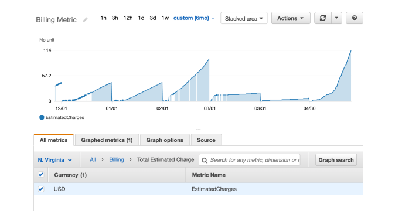
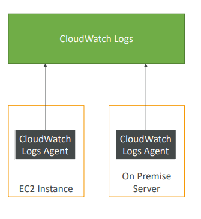
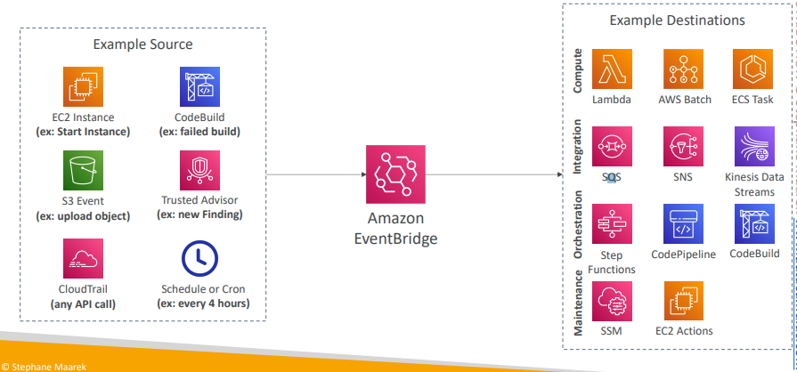
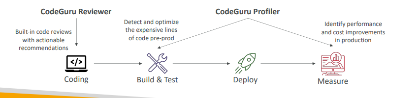

# Cloud monitoring

## Amazon CloudWatch Metrics

- CloudWatch provides metrics for every services in AWS
- **Metric** is a variable to monitor (CPUUtilization, NetworkIn…)
- Metrics have timestamps
- Can create **CloudWatch dashboards** of metrics

## Example: CloudWatch Billing metric (us-east-1)

## Important Metrics
- EC2 instances: CPU Utilization, Status Checks, Network (not RAM)
- Default metrics every 5 minutes
- Option for Detailed Monitoring ($$$): metrics every 1 minute
- EBS volumes: Disk Read/Writes
- S3 buckets: BucketSizeBytes, NumberOfObjects, AllRequests
- Billing:Total Estimated Charge (only in us-east-1)
- Service Limits: how much you’ve been using a service API
- Custom metrics: push your own metrics

## Amazon ClouldWatch Alarms

- Alarms are used to trigger notifications for any metric
- Alarms actions…
  - **Auto Scaling**: increase or decrease EC2 instances “desired” count
  - **EC2 Actions**: stop, terminate, reboot or recover an EC2 instance
  - **SNS notifications**: send a notification into an SNS topic
- Various options (sampling, %, max, min, etc…)
- Can choose the period on which to evaluate an alarm
- Example: create a **billing alarm** on the CloudWatch Billing metric
- Alarm States: OK. INSUFFICIENT_DATA, ALARM

## Amazon CloudWatch Logs 
- CloudWatch Logs can collect log from: 
  - Elastic Beanstalk: collection of logs from application 
  - ECS: collection from containers 
  - AWS Lambda: collection from function logs 
  - CloudTrail based on filter 
  - CloudWatch log agents: on EC2 machines or on-premises servers 
  - Route53: Log DNS queries 
- Enables **real-time monitoring** of logs 
- Adjustable CloudWatch Logs retention

## CloudWatch Logs for EC2

- By default, no logs from your EC2 instance will go to CloudWatch
- You need to run a CloudWatch agent on EC2 to push the log files you want
- Make sure IAM permissions are correct
- The CloudWatch log agent can be setup on-premises too

## Amazon EventBridge (formerly CloudWatch Events)
- Schedule: Cron jobs (scheduled scripts)
- Event Pattern: Event rules to react to a service doing something
- Trigger Lambda functions, send SQS/SNS messages…

- Schema Registry: model event schema
- You can **archive events** (all/filter) sent to an event bus (indefinitely or set period)
- Ability to **replay archived events**

## CloudTrail Overview
- **Provides governance, compliance and audit for your AWS Account**
- CloudTrail is enabled by default!
- Get an **history of events / API calls made within your AWS Account** by:
- Console
- SDK
- CLI
- AWS Services
- Can put logs from CloudTrail into CloudWatch Logs or S3
- **A trail can be applied to All Regions (default) or a single Region.**
- If a resource is deleted in AWS, investigate CloudTrail first!

## CloudTrail Diagram

## AWS X-Ray
- Get tracing and visual analysis of your application
- Debugging in Production, the good old way:
  - Test locally
  - Add log statements everywhere
  - Re-deploy in production
- Log formats differ across applications and log analysis is hard.
- Debugging: one big monolith “easy”, distributed services “hard”
- No common views of your entire architecture
- Enter… AWS X-Ray!

## AWS X-Ray - Visual analysis of our applications

## AWS X-Ray advantages

Troubleshooting performance (bottlenecks)
 - Understand dependencies in a microservice architecture 
 - Pinpoint service issues 
 - Review request behavior 
 - Find errors and exceptions 
 - Are we meeting time SLA? 
 - Where I am throttled? 
 - Identify users that are impacted 

 ## CodeGuru
 - An ML-powered service for **automated code reviews** and **application performance recommendations**
- Provides two functionalities
  - **CodeGuru Reviewer**: automated code reviews for static code analysis (development)
  - **CodeGuru Profiler**: visibility/recommendations about application performance during
  runtime (production)

## Amazon CodeGuru Reviewer
- Identify critical issues, security, vulnerabilities, and hard-to-find bugs
- Example: common coding best practices, resource leaks, security detection, input validation
- Uses Machine Learning and automated reasoning
- Hard-learned lessons across millions of code reviews on 1000s of open-source and Amazon repositories
- Supports Java and Python
- Integrates with GitHub, Bitbucket, and AWS CodeCommit

## Amazon CodeGuru Profiler
- Helps understand the runtime behavior of your application
- Example: identify if your application is consuming excessive CPU capacity on a logging routine
- Features:
  - Identify and remove code inefficiencies
  - Improve application performance (e.g., reduce CPU utilization)
  - Decrease compute costs
  - Provides heap summary (identify which objects using up memory)
  - Anomaly Detection
- Support applications running on AWS or on- premise
- Minimal overhead on application

## AWS Status - Service Health Dashboard 
- Shows all regions, all services health 
- Shows historical information for each day 
- Has an RSS feed you can subscribe to

# AWS Personal Health Dashboard
- AWS Personal Health Dashboard provides **alerts and remediation guidance** when AWS is experiencing **events that may impact you**.
- While the Service Health Dashboard displays the general status of AWS services, Personal Health Dashboard gives you a **personalized view into the performance and availability of the AWS services underlying your AWS resources**.
- The dashboard displays **relevant and timely information** to help you manage events in progress and provides proactive notification to help you plan for **scheduled activities**. 

- Shows how AWS outages directly impact you & your AWS resources
- Alert, remediation, proactive, scheduled activities

## Monitoring Summary
- CloudWatch:
  - Metrics: monitor the performance of AWS services and billing metrics
  - Alarms: automate notification, perform EC2 action, notify to SNS based on metric
  - Logs: collect log files from EC2 instances, servers, Lambda functions…
  - Events (or EventBridge): react to events in AWS, or trigger a rule on a schedule
- CloudTrail: audit API calls made within your AWS account
- CloudTrail Insights: automated analysis of your CloudTrail Events
- X-Ray: trace requests made through your distributed applications
- Service Health Dashboard: status of all AWS services across all regions
- Personal Health Dashboard: AWS events that impact your infrastructure
- Amazon CodeGuru: automated code reviews and application performance recommendations

