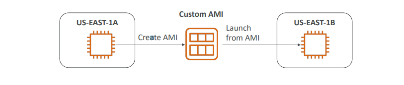
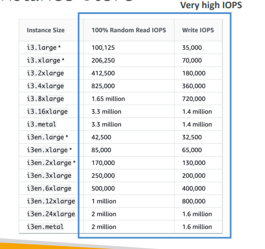
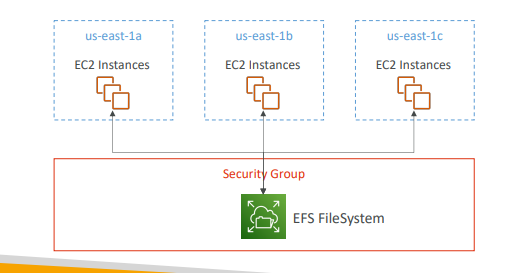
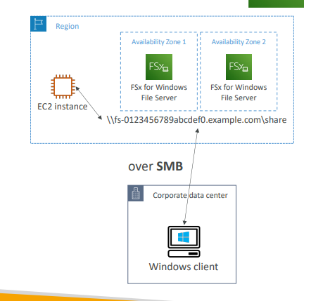
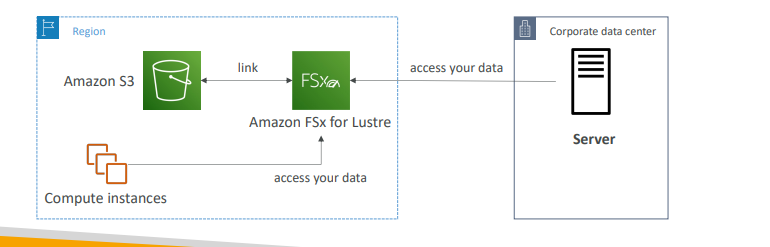

### EC2 Instance Storage Section
- An EBS (Elastic Block Store) Volume is a network drive you can attach to your instances while they run
- It allows your instances to persist data, even after their termination
- They can only be mounted to one instance at a time (at the CCP level)
- They are bound to a specific availability zone
- Analogy: Think of them as a “network USB stick” 
- Free tier: 30 GB of free EBS storage of type General Purpose (SSD) or Magnetic per month

### EBS Volume
-  It’s a network drive (i.e. not a physical drive)
    - It uses the network to communicate the instance, which means there might be a bit of latency
    - It can be detached from an EC2 instance and attached to another one quickly
- It’s locked to an Availability Zone (AZ)
  - An EBS Volume in us-east-1a cannot be attached to us-east-1b
  - To move a volume across, you first need to snapshot it
- Have a provisioned capacity (size in GBs, and IOPS)
  - You get billed for all the provisioned capacity
  - You can increase the capacity of the drive over time

### EBS Overview

  

### EBS – Delete on Termination attribute

 

- Controls the EBS behaviour when an EC2 instance terminates
  - By default, the root EBS volume is deleted (attribute enabled)
  - By default, any other attached EBS volume is not deleted (attribute disabled)
- This can be controlled by the AWS console / AWS CLI
- **Use case: preserve root volume when instance is terminated**

### EBS Snapshots
- Make a backup (snapshot) of your EBS volume at a point in time
- Not necessary to detach volume to do snapshot, but recommended
- Can copy snapshots across AZ or Region

### EBS Snapshots 
- EBS Snapshot Archive
  - Move a snapshot to an "archive tier" that is 75% cheaper
  - Takes within 24 to 72 hours for restoring the archive

- Recycle Bin for EBD Snapshots
  - Setup rules to retain deleted snapshots so you can recover them after an accidental deletion
  - Specify retention (from 1 day to 1 year)

### AMI Overview
- AMI = Amazon Machine Image
- **AMI are a customization of an EC2 instance**
 - You add your own software, configuration, operating system, monitoring…
 - Faster boot / configuration time because all your software is pre-packaged
 - AMI are built for a specific region (and can be copied across regions)
 - You can launch EC2 instances from:
   - A Public AMI: AWS provided
   - Your own AMI: you make and maintain them yourself
   - An AWS Marketplace AMI: an AMI someone else made (and potentially sells)

### EC2 Image Builder
- Used to automate the creation of Virtual Machines or container images
- => Automate the creation, maintain, validate and test EC2 AMIs
- Can be run on a schedule (weekly, whenever packages are updated, etc…)
- Free service (only pay for the underlying resources)

### EC2 Instance Store
- EBS volumes are network drives with good but “limited” performance
- If you need a high-performance hardware disk, use EC2 Instance Store
- Better I/O performance
- EC2 Instance Store lose their storage if they’re stopped (ephemeral)
- Good for buffer / cache / scratch data / temporary content
- Risk of data loss if hardware fails
- Backups and Replication are your responsibility 

### Local EC2 Instance Store (high performance hardware attached volume)

### EFS - Elastic File System
- Managed NFS (network file system) that can be mounted on 100s of EC2
- EFS works with Linux EC2 instances in multi-AZ
- Highly available, scalable, expensive (3x gp2), pay per use, no capacity planning

### Difference between EBS vs EFS

| EBS    |EFS |
| ----------- | ----------- |
| To transfer EBS to different AZ, you have to make a copy of it (EBS snapshot),  and restore that copy to wanted AZ     | EFS makes a shared file system. All instances in AZs and mount the same EFS file |

### Shared Responsibility Model for EC2 Storage
|AWS   |User|
| ----------- | ----------- |
| <ul><li>Infrastructure</li><li>Replication for data for EBS volumes & EFS drives</li><li>Replacing faulty hardware</li><li>Ensuring their employees cannot access your data</li></ul>    | <ul><li>Setting up backup / snapshot procedures</li><li>Setting up data encryption</li><li>Responsibility of any data on the drives</li><li>Understanding the risk of using EC2 Instance Store</li></ul>    |

### Amazon FSx – Overview 
- Launch 3rd party high-performance file systems on AWS
- Fully managed service. ex: FSx for Lustre, FSx for Windows File Server, FSx for NetApp ONTAP

### Amazon FSx for windows File Server
- A fully managed, high reliable, and scalable **Windows native** shared file system
- Built on Windows File Server
- Supports SMB protocol & Windows NTFS
- Integrated with Microsoft Active Directory
- Integrated with Microsoft Active Directory
- Can be accessed from AWS or your on-premise infrastructure

### Amazon FSx for Lustre
- A fully managed, high-performance, scalable file storage for High Performance Computing (HPC)
- The name Lustre is derived from “Linux” and “cluster”
- Machine Learning, Analytics, Video Processing, Financial Modeling, …
- Scales up to 100s GB/s, millions of IOPS, sub-ms latencies

### EC2 Instance Storage - Summary
- EBS volumes:
  - Network drives attached to one EC2 instance at a time
  - Mapped to an Availability Zones 
  - Can use EBS Snapshots for backups / transferring EBS volumes across AZ 
- AMI: create ready-to-use EC2 instances with our customizations
- EC2 Image Builder: automatically build, test and distribute AMIs
- EC2 Instance Store: 
  - High performance hardware disk attached to our EC2 instance 
  - Lost if our instance is stopped / terminated
- EFS: network file system, can be attached to 100s of instances in a region
- EFS-IA: cost-optimized storage class for infrequent accessed files 
- FSx for Windows: Network File System for Windows servers
- FSx for Lustre: High Performance Computing Linux file system

