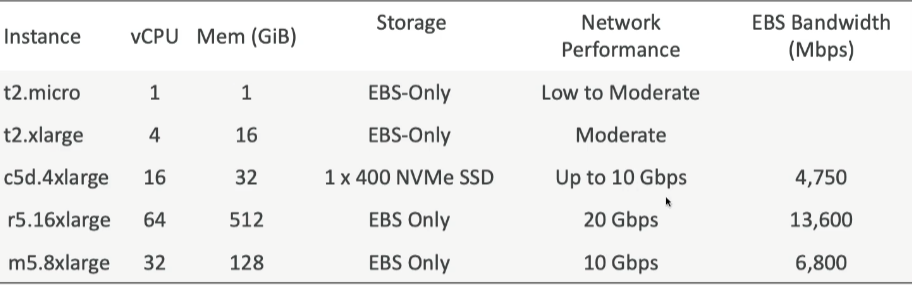
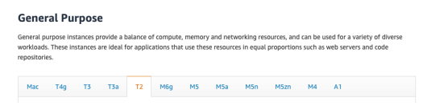
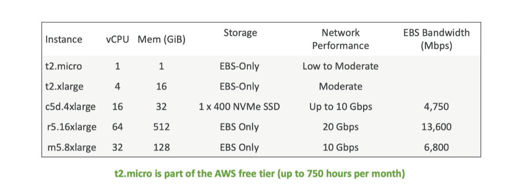
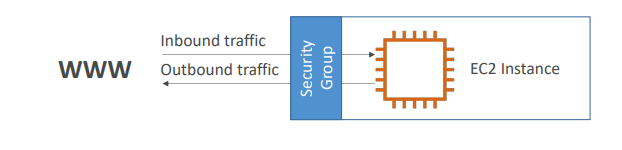
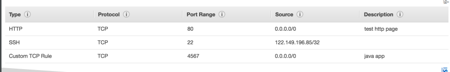
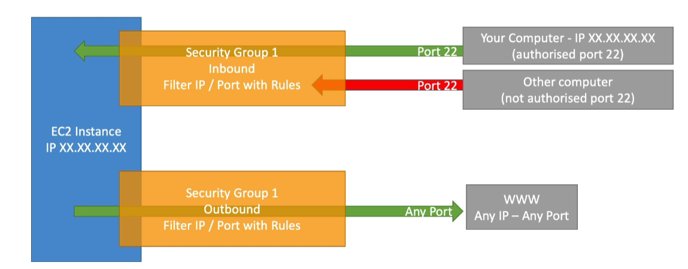
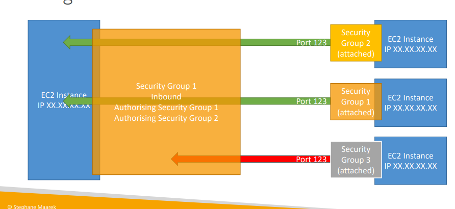
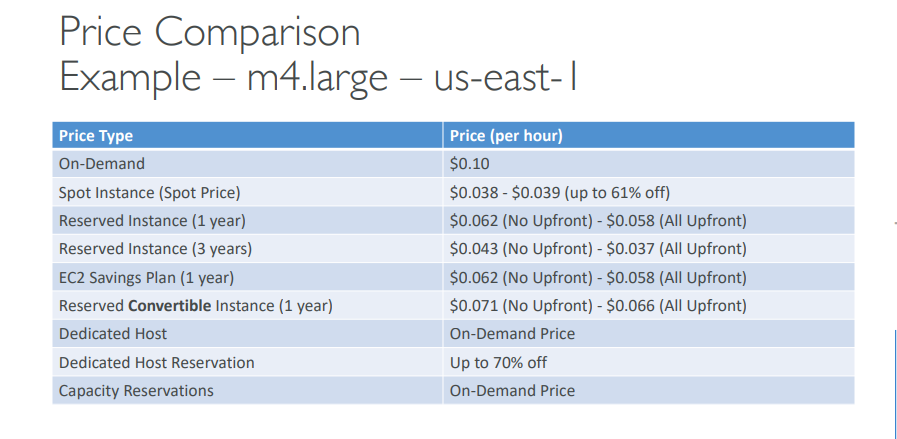

## Elastic Compute Cloud - EC2

### EC2 Basics

- EC2 is one of the most popular of AWS’ offering
- EC2 = Elastic Compute Cloud = Infrastructure as a Service
- It mainly consists in the capability of:

  - Renting virtual machines (EC2)
  - Storing data on virtual drives (EBS)
  - Distributing load across machines (ELB)
  - Scaling the services using an auto-scaling group (ASG)

- Knowing EC2 is fundamental to understand how the Cloud works

#### EC2 sizing & configuration options

- Operating System (OS): Linux, Windows or Mac OS
- How much compute power & cores (CPU)
- How much random-access memory (RAM)
- How much storage space:
  - Network-attached (EBS & EFS)
  - hardware (EC2 Instance Store)
- Network card: speed of the card, Public IP address
- Firewall rules: security group
- Bootstrap script (configure at first launch): EC2 User Data

#### EC2 User Data

- It is possible to bootstrap our instances using an EC2 User data script
- Bootstrapping means launching commands when a machine starts
- That script is only run once at the instance first start
- EC2 user data is used to automate boot tasks such as:
  - Installing updates
  - Installing software
  - Downloading common files from the internet
  - Anything you can think of
- The EC2 User Data Script runs with the root user



### Launching an EC2 Instance running Linux

- We’ll be launching our first virtual server using the AWS Console
- We’ll get a first high-level approach to the various parameters
- We’ll see that our web server is launched using EC2 user data
- We’ll learn how to start / stop / terminate our instance.

### EC2 Instance Types - Overview

- You can use different types of EC2 instances that are optimised for
  different use cases (https://aws.amazon.com/ec2/instance-types/)

- AWS has the following naming convention: m5.2xlarge
  - m: instance class
  - 5: generation (AWS improves them over time. After m5 -> m6)
  - 2xlarge: size within the instance class

### EC2 Instance Types - General Purpose

- Great for a diversity of workloads such as web servers or code repositories
- Balance between:
  - Compute
  - Memory
  - Networking
- In the course, we will be using the t2.micro which is a General Purpose EC2 instance



| Compute Optimized                                                                                                                                                                                                                                                                                                         | Memory Optimized                                                                                                                                                                                                                                                                                                                                      | Storage Optimized                                                                                                                                                                                                                                                                                                                                                                                                                                        |
| ------------------------------------------------------------------------------------------------------------------------------------------------------------------------------------------------------------------------------------------------------------------------------------------------------------------------- | ----------------------------------------------------------------------------------------------------------------------------------------------------------------------------------------------------------------------------------------------------------------------------------------------------------------------------------------------------- | -------------------------------------------------------------------------------------------------------------------------------------------------------------------------------------------------------------------------------------------------------------------------------------------------------------------------------------------------------------------------------------------------------------------------------------------------------- |
| <ul><li>Great for compute-intensive tasks that require high performance processors:</li><li>Batch processing workloads</li><li> Media transcoding</li><li>High performance web servers</li><li>High performance computing (HPC)</li><li>Scientific modeling & machine learning</li><li> Dedicated gaming server</li></ul> | <ul><li>Fast performance for workloads that process large data sets in memory</li><li> High performance, relational/non-relational databases</li><li> Distributed web scale cache stores</li><li>In-memory databases optimized for BI (business intelligence)</li><li>Applications performing real-time processing of big unstructured data</li></ul> | <ul><li>Great for storage-intensive tasks that require high, sequential read and write access to large data sets on local storage</li><li> High performance, relational/non-relational databases</li><li> High frequency online transaction processing (OLTP) systems</li><li>Relational & NoSQL databases</li><li>Cache for in-memory databases (for example, Redis)</li><li> Data warehousing applications</li><li> Distributed file systems</li></ul> |



### Security Groups

- Security Groups are the fundamental of network security in AWS
- They control how traffic is allowed into or out of our EC2 Instances.
- Security groups only contain rules
- Security groups rules can reference by IP or by security group



### Security Groups Deeper Dive

- Security groups are acting as a “firewall” on EC2 instances
- They regulate:

  - Access to Ports
  - Authorised IP ranges – IPv4 and IPv6
  - Control of inbound network (from other to the instance)
  - Control of outbound network (from the instance to other)

  

### Security Groups Diagram



### Security Groups - Good to know

- Can be attached to multiple instances
- Locked down to a region / VPC combination. If you switch region, you need to create security groups again
- Does live “outside” the EC2 – if traffic is blocked the EC2 instance won’t see it
- It’s good to maintain one separate security group for SSH acces
- If your application is not accessible (time out), then it’s a security group issue
- If your application gives a “connection refused“ error, then it’s an application error or it’s not launched
- All inbound traffic is blocked by default
- All outbound traffic is authorised by default



### Classic Ports to know

| 22: SSH (secure shell)    | 21 = FTP (File Transfer Protocol) | 22 = SFTP (Secure File Transfer Protocol) | 80 = HTTP                 | 443 = HTTPS             | 3389 = RDP (Remote Desktop Protocol) |
| ------------------------- | --------------------------------- | ----------------------------------------- | ------------------------- | ----------------------- | ------------------------------------ |
| log into a Linux instance | upload files into a file share    | upload files using SSH                    | access unsecured websites | access secured websites | log into a Windows instance          |

### SSH Summary Table


- SSH is one of the most important function. It allows you to control a remote machine, all using the command line.


- running EC2 instance on your local terminal

```js
ssh -i.\instance_name.pem ec2-user@public_IVP_port

```

### EC2 Instance Roles Demo

- Never to configure in CLI. Do attach IAM roles to EC2 Instance. IAM roles will assign permission t SSH to access to our infomation

### EC2 Instance Purchasing Options

- On-Demand Instances – short workload, predictable pricing, pay by second
- Reserved (1 & 3 years)
  - Reserved Instances – long workloads
  - Convertible Reserved Instances – long workloads with flexible instances
- Savings Plans (1 & 3 years) –commitment to an amount of usage, long workload
- Spot Instances – short workloads, cheap, can lose instances (less reliable)
- Dedicated Hosts – book an entire physical server, control instance placement
- Dedicated Instances – no other customers will share your hardware
- Capacity Reservations – reserve capacity in a specific AZ for any duration

| On-Demand Instances                                | Reserved (1 & 3 years)                                                                                                                 | Savings Plans (1 & 3 years)                     | Spot Instances                                             | Dedicated Hosts                                            | Dedicated Instances                         | Capacity Reservations                              |
| -------------------------------------------------- | -------------------------------------------------------------------------------------------------------------------------------------- | ----------------------------------------------- | ---------------------------------------------------------- | ---------------------------------------------------------- | ------------------------------------------- | -------------------------------------------------- |
| short workload, predictable pricing, pay by second | <ul><li>Reserved Instances – long workloads</li><li> Convertible Reserved Instances – long workloads with flexible instances</li></ul> | commitment to an amount of usage, long workload | short workloads, cheap, can lose instances (less reliable) | book an entire physical server, control instance placement | no other customers will share your hardware | reserve capacity in a specific AZ for any duration |

### EC2 On Demand

- Pay for what you use:
  - Linux or Windows - billing per second, after the first minute
  - All other operating systems - billing per hour
- Has the highest cost but no upfront payment
- No long-term commitment
- Recommended for **short-term** and **un-interrupted workloads**, where you can't predict how the application will behave

### EC2 Reserved Instances

- Up to 72% discount compared to On-demand
- You reserve a specific instance attributes (Instance Type, Region, Tenancy, OS)
- Reservation Period – 1 year (+discount) or 3 years (+++discount)
- Payment Options – No Upfront (+), Partial Upfront (++), All Upfront (+++)
- Reserved Instance’s Scope – Regional or Zonal (reserve capacity in an AZ)
- Recommended for steady-state usage applications (think database)
- You can buy and sell in the Reserved Instance Marketplace

### Convertible Reserved Instance

- Can change the EC2 instance type, instance family, OS, scope and tenancy
- Up to 66% discount

### EC2 Saving Plans

- Get a discount based on long-term usage (up to 72% - same as RIs)
- Commit to a certain type of usage ($10/hour for 1 or 3 years)
- Usage beyond EC2 Savings Plans is billed at the On-Demand price
- Locked to a specific instance family & AWS region (e.g., M5 in us-east-1)
- Flexible across:
  - Instance Size (e.g., m5.xlarge, m5.2xlarge)
  - OS (e.g., Linux, Windows)
  - Tenancy (Host, Dedicated, Default)

### EC2 Spot Instances

- Can get a discount of up to 90% compared to On-demand
- Instances that you can “lose” at any point of time if your max price is less than the current spot price
- The MOST cost-efficient instances in AWS
- Useful for workloads that are resilient to failure
  - Batch jobs
  - Data analysis
  - Image processing
  - Any distributed workloads
  - Workloads with a flexible start and end time
- Not suitable for critical jobs or databases

### EC2 Dedicated Hosts

- A physical server with EC2 instance capacity fully dedicated to your use
- Allows you address compliance requirements and use your existing server- bound software licenses (per-socket, per-core, pe—VM software licenses)
- Purchasing Options:
  - On-demand – pay per second for active Dedicated Host
  - Reserved - 1 or 3 years (No Upfront, Partial Upfront, All Upfront)
- The most expensive option
- Useful for software that have complicated licensing model (BYOL – Bring Your Own License)
- Or for companies that have strong regulatory or compliance needs

### EC2 Dedicated Instances

- Instances run on hardware that’s dedicated to you
- May share hardware with other instances in same account
- No control over instance placement (can move hardware after Stop / Start)
- Difference between EC2 dedicated instances vs dedicated hosts: dedicated instances mean you have your own instance and own hardware.Dedicated host give you access to physical instances itself.

### EC2 Capacity Reservations

- Reserve On-Demand instances capacity in a specific AZ for any duration
- You always have access to EC2 capacity when you need it
- No time commitment (create/cancel anytime), no billing discounts
- Combine with Regional Reserved Instances and Savings Plans to benefit from billing discounts
- You’re charged at On-Demand rate whether you run instances or not
- Suitable for short-term, uninterrupted workloads that needs to be in a specific AZ




### Shared Responsibility Model for EC2

| AWS                                                                                                                                                            | USER                                                                                                                                                                                                                                                    |
| -------------------------------------------------------------------------------------------------------------------------------------------------------------- | ------------------------------------------------------------------------------------------------------------------------------------------------------------------------------------------------------------------------------------------------------- |
| <ul><li>Infrastructure (global network security)</li><li>Isolation on physical hosts</li><li>Replacing faulty hardware</li><li>Compliance validation</li></ul> | <ul><li>Security Groups rules</li><li>Operating-system patches and updates</li><li>Software and utilities installed on the EC2 instance</li><li>IAM Roles assigned to EC2 & IAM user access management</li><li>Data security on your instance</li></ul> |


### EC2 Section - Summary 
- EC2 Instance: AMI (OS) + Instance Size (CPU + RAM) + Storage + security groups + EC2 User Data
- Security Groups: Firewall attached to the EC2 instance
- EC2 User Data: Script launched at the first start of an instance
- SSH: start a terminal into our EC2 Instances (port 22)
- EC2 Instance Role: link to IAM roles
- Purchasing Options: On-Demand, Spot, Reserved (Standard + Convertible + Scheduled), Dedicated Host, Dedicated Instance
