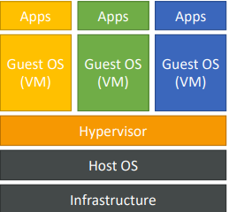
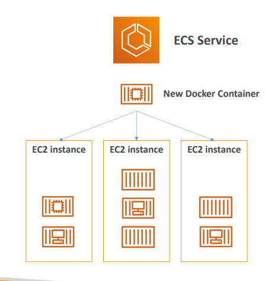
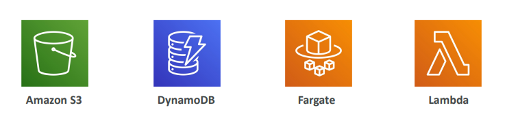
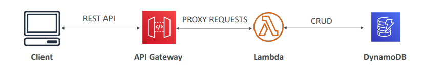

# What is Docker?
- Docker is a software development platform to deploy apps
- Apps are packaged in containers that can be run on any OS
- **Apps run the same, regardless of where they’re run**
  - Any machine 
  - No compatibility issues 
  - Predictable behavior 
  - Less work 
  - Easier to maintain and deploy
  - Works with any language, any OS, any technology
- Scale containers up and down very quickly (seconds)

### Docker on an OS

## Where Docker images are stored?
- Docker images are stored in Docker Repositories
- Public: Docker Hub https://hub.docker.com/ 
  - Find base images for many technologies or OS: 
  - Ubuntu 
  - MySQL 
  - NodeJS, Java…
- Private: Amazon ECR (Elastic Container Registry)

## Docker versus Virtual Machines
- Docker is ”sort of” a virtualization technology, but not exactly
- Resources are shared with the host => many containers on one server

  

## ECS
- ECS = Elastic Container Service
-  Launch Docker containers on AWS
- **You must provision & maintain the infrastructure (the EC2 instances)**
- AWS takes care of starting /stopping containers
-  Has integrations with the Application Load Balancer

## Fargate
- Launch Docker containers on AWS
- **You do not provision the infrastructure (no EC2 instances to manage)– simpler!**

- Serverless offering • AWS just runs containers for you based on the CPU / RAM you need

## ECR
- Elastic Container Registry 
- Private Docker Registry on AWS
- This is where you store your Docker images so they can be run by ECS or Fargate

- Elastic Container Registry 
- Private Docker Registry on AWS
- This is where you **store your Docker images** so they can be run by ECS or Fargate

## What’s serverless
- Serverless is a new paradigm in which the developers don’t have to manage servers anymore… 
- They just deploy code
- They just deploy… functions !
- Initially... Serverless == FaaS (Function as a Service)
- Serverless was pioneered by AWS Lambda but now also includes anything that’s managed: “databases, messaging, storage, etc.
- **Serverless does not mean there are no servers…** it means you just don’t manage / provision / see them

## Severless Introduction
- Serverless is a new paradigm in which the developers don’t have to manage servers anymore
- They just deploy code
- They just deploy function!
- Initially... Serverless == FaaS (Function as a Service)
- Serverless was pioneered by AWS Lambda but now also includes anything that’s managed: “databases, messaging, storage, etc.
- Serverless does not mean there are no servers… it means you just don’t manage / provision / see them
- example: 

## AWS Lambda

Amazon EC2

| Amazon EC2 | Amazon Lambda  | 
| --- |--- | 
| <ul><li>Virtual Servers in the Cloud</li><li>Limited by RAM and CPU</li><li>Continuously running</li><li>Scaling means intervention to add / remove servers</li></ul> |<ul><li>Virtual functions – no servers to manage!</li><li>Limited by time - short executions</li><li>Run <b>on-demand</b></li><li><b>Scaling is automated!</b></li></ul>  |

## Benefits of AWS Lambda
- Easy Pricing:
  - Pay per request and compute time
  - Free tier of 1,000,000 AWS Lambda requests and 400,000 GBs of compute time
- Integrated with the whole AWS suite of services
- Event-Driven: functions get invoked by AWS when needed
- Integrated with many programming languages
- Easy monitoring through AWS CloudWatch
- Easy to get more resources per functions (up to 10GB of RAM!)
- Increasing RAM will also improve CPU and network!

## AWS Lambda language support
- Node.js (JavaScript) 
- Python 
- Java (Java 8 compatible) 
- C# (.NET Core) 
- Golang 
- C# / Powershell 
- Ruby 
- Custom Runtime API (community supported, example Rust)

- Lambda Container Image  
  - The container image must implement the Lambda Runtime API
  - ECS / Fargate is preferred for running arbitrary Docker images

## Serverless Thumbnail creation

## Serverless CRON Job (define a schedule)

## AWS Lambda Pricing: example
- checkout here: https://aws.amazon.com/lambda/pricing/

| Pay per calls  | Pay per duration: (in increment of 1 ms) |
| ------------- | ------------- |
| <ul><li>First 1,000,000 requests are free</li><li>$0.20 per 1 million requests thereafter ($0.0000002 per request)</li></ul>  | <ul><li>400,000 GB-seconds of compute time per month for FREE</li><li>== 400,000 seconds if function is 1GB RAM</li><li>== 3,200,000 seconds if function is 128 MB RAM</li><li>After that $1.00 for 600,000 GB-seconds</li></ul>  |

- It is usually very cheap to run AWS Lambda so it’s very popular

## Amazon API Gateway
- **building a serverless API**

- Fully managed service for developers to easily create, publish, maintain, monitor, and secure APIs
- Serverless and scalable
- Supports RESTful APIs and WebSocket APIs
- Support for security, user authentication, API throttling, API keys, monitoring...

## AWS Batch
- Fully managed batch processing at any scale
- Efficiently run 100,000s of computing batch jobs on AWS
- A “batch” job is a job with a start and an end (opposed to continuous)
- Batch will dynamically launch EC2 instances or Spot Instances
- AWS Batch provisions the right amount of compute / memory
- You submit or schedule batch jobs and AWS Batch does the rest!
- Batch jobs are defined as **Docker images** and **run on ECS**
- Helpful for cost optimizations and focusing less on the infrastructure

## Batch vs Lambda

| Lambda  |Batch|
| ------------- | ------------- |
|<ul><li>Time limit</li><li>Limited runtimes</li><li>Limited temporary disk space</li><li>Serverless</li></ul> |<ul><li>No time limit</li><li>Any runtime as long as it’s packaged as a Docker image </li><li>Rely on EBS / instance store for disk space</li><li> Relies on EC2 (can be managed by AWS)</li></ul>   |

## Amazon Lightsail

- Virtual servers, storage, databases, and networking
- Low & predictable pricing
- Simpler alternative to using EC2, RDS, ELB, EBS, Route 53…
- Great for people with **little cloud experience**!
- Can setup notifications and monitoring of your Lightsail resources
- Use cases:
  - Simple web applications (has templates for LAMP, Nginx, MEAN, Node.js…)
  - Websites (templates for WordPress, Magento, Plesk, Joomla)
  - Dev / Test environment
- Has high availability but **no auto-scaling**, limited AWS integrations

## SUmmary
- Docker: container technology to run applications
- ECS: run Docker containers on EC2 instances
- Fargate:
  - Run Docker containers without provisioning the infrastructure
  - Serverless offering (no EC2 instances)
- ECR: Private Docker Images Repository
- Batch: run batch jobs on AWS across managed EC2 instances
- Lightsail: predictable & low pricing for simple application & DB stacks

## Lambda Summary
- Lambda is Serverless, Function as a Service, seamless scaling, reactive
- Lambda Billing:
  - By the time run x by the RAM provisioned
  - By the number of invocations
- Language Support: many programming languages except (arbitrary) Docker
- Invocation time: up to 15 minutes
- Use cases:
  - Create Thumbnails for images uploaded onto S3
  - Run a Serverless cron job
- API Gateway: expose Lambda functions as HTTP API