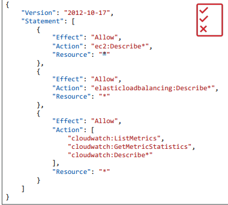
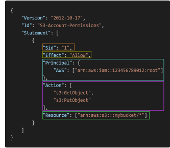
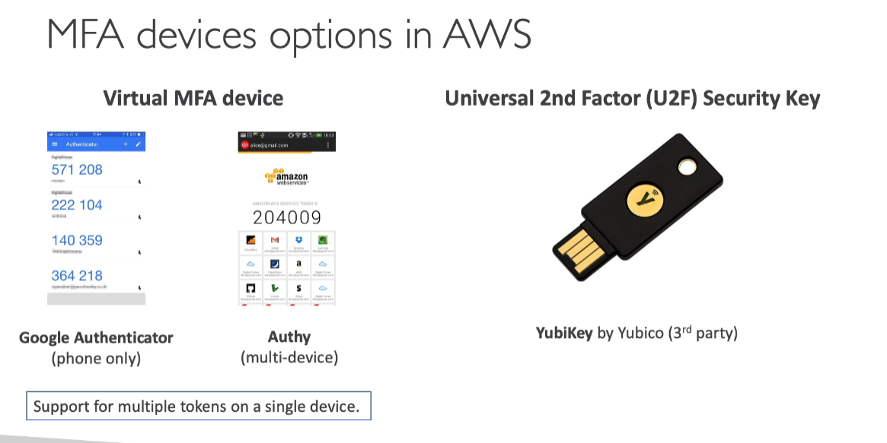
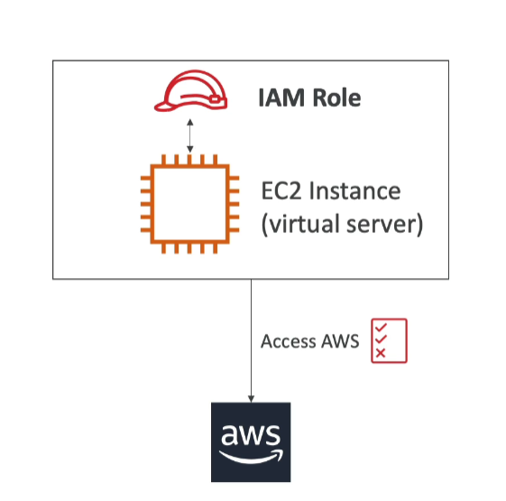

## IAM - Users & Groups
- AM = Identity and Access Management, Global service
- Root account created by default, shouldn’t be used or shared
- Users are people within your organization, and can be grouped

- **Groups only contain users, not other groups**
- Users don’t have to belong to a group, and user can belong to multiple groups

### IAM: Permissions
- Users or Groups can be
assigned JSON documents
called policies
- These policies define the permissions of the users
- In AWS you apply the least privilege principle: don’t give more permissions than a user needs. Ex: users can use uneccessary services-> cost and not secured

### IAM Policies inheritance

### IAM Policies Structure

- Consist of:
  + Version: policy language version, always include "2012-10-17"
  + Id: an identifier for the policy
  + Statement: one or more individual statements (required)
    + Sid: an identifier for the statement
    + Effect: whether the statement allows or denies access (Allow, Deny)
    + Principal: account/user/role to which this policy applied to
    + Action: list of actions this policy allows or denies
    + Resource: list of resources to which this actions applied to
    + Condition: conditions for when this policy is in effect (optional)

  

### Password Policy
- Strong passwords = higher security for your account
  - In AWS, you can setup a password policy:
  - Set a minimum password length
  - Require specific character types:
    - including uppercase letters
    - lowercase letters
    - numbers
    - non-alphanumeric characters
- Allow all IAM users to change their own passwords
- Require users to change their password after some time (password expiration)
- Prevent password re-use

### Multi Factor Authentication - MFA
- Users have access to your account and can possibly change configurations or delete resources in your AWS account
- **You want to protect your Root Accounts and IAM users**

 

- Main benefit of MFA: **if a password is stolen or hacked, the account is not compromised**

### MFAA devices options in AWS
 

### How can users access  AWS?
- To access AWS, you have three options:
  - AWS Management Console (protected by password + MFA)
  - AWS Command Line Interface (CLI): protected by access keys
  - AWS Software Developer Kit (SDK) - for code: protected by access keys
- Access Keys are generated through the AWS Console
- Users manage their own access keys
- Access Keys are secret, just like a password. Don’t share them
- Access Key ID ~= username
- Secret Access Key ~= password

#### AWS CLI
- A tool that enables you to interact with AWS services using commands in
your command-line shell
- Direct access to the public APIs of AWS services
- You can develop scripts to manage your resources
- It’s open-source https://github.com/aws/aws-cli
- Alternative to using AWS Management Console

 
 
### AWS SDK
- AWS Software Development Kit (AWS SDK)
- Language-specific APIs (set of libraries)
- Enables you to access and manage AWS services
programmatically
- Embedded within your application
- Supports
  + SDKs (JavaScript, Python, PHP, .NET, Ruby, Java, Go, Node.js,
C++)
  + Mobile SDKs (Android, iOS, …)
  + IoT Device SDKs (Embedded C, Arduino, …)

- AWS CLI is built on AWS SDK for Python

### IAM Roles for Services
- Some AWS service will need to perform actions on your behalf
- To do so, we will assign permissions to AWS services
with IAM Roles
- Common roles:  
  + EC2 Instance Roles 
  + Lambda Function Roles 
  + Roles for CloudFormation 
  
  

### IAM Security Tools
 - IAM Credentials Report (account-level)
   + a report that lists all your account's users and the status of their various
credentials

 - IAM Access Advisor (user-level)
   + Access advisor shows the service permissions granted to a user and when those
services were last accessed.
   + You can use this information to revise your policies

### IAM Guidlines & Best Practices

- Don't use the root account except for AWS account setup
- One physical user = One AWS user
- Assign users to groups and assign permissions to group
- Create a strong password policy
- Use and enforce the use of Multi Factor Authentication (MFA)
- Create and use Roles for giving permissions to AWS services
- Use Access Keys for Programmatic Access (CLI / SDK)
- Audit permissions of your account with the IAM Credentials Report
- Never share IAM users & Access Keys

### Shared Responsibilitiy Model for IAM

  

## Summary - IAM Section
 
 - **Users**: mapped to a physical user, has a password for AWS Console
 - **Groups**: contains users only
 - **Policies**: JSON document that outlines permissions for users or groups
 - **Roles**: for EC2 instances or AWS services
 - **Security**: MFA + Password Policy
 - **AWS CLI**: manage your AWS services using the command-line
 - **AWS SDK**: manage your AWS services using a programming language
 - **Access Keys**: access AWS using the CLI or SDK
 - **Audit**: IAM Credential Reports & IAM Access Advisor
 