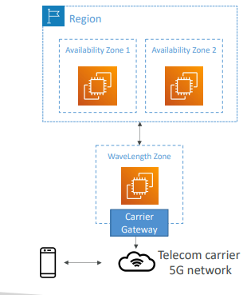

# AWS Global Infrastructure
- A global application is an application deployed in **multiple geographies**
- On AWS: this could be Regions and / or Edge Locations
- **Decreased Latency**
  - Latency is the time it takes for a network packet to reach a server
  - It takes time for a packet from Asia to reach the US
  - Deploy your applications closer to your users to decrease latency, better experience
- **Disaster Recovery (DR)**
  - If an AWS region goes down (earthquake, storms, power shutdown, politics)…
  - You can fail-over to another region and have your application still working
  - A DR plan is important to increase the availability of your application
- **Attack protection**: distributed global infrastructure is harder to attack

## Global AWS Infrastructure 
- Regions: For deploying applications and infrastructure
- Availability Zones: Made of multiple data centers
- Edge Locations (Points of Presence): for content delivery as close as possible to users

## Global Applications in AWS
- Global DNS: Route 53
  - Great to route users to the closest deployment with least latency
  - Great for disaster recovery strategies
- Global Content Delivery Network (CDN): CloudFront
  - Replicate part of your application to AWS Edge Locations – decrease latency
  - Cache common requests – improved user experience and decreased latency
- S3 Transfer Acceleration
  - Accelerate global uploads & downloads into Amazon S3
- AWS Global Accelerator:
  - Improve global application availability and performance using the AWS global network

## Amazon Route 53 Overview
- Route53 is a Managed DNS (Domain Name System)
- DNS is a collection of rules and records which helps clients understand how to reach a server through URLs
- In AWS, the most common records are:
  - www.google.com => 12.34.56.78 == A record (IPv4)
  - www.google.com => 2001:0db8:85a3:0000:0000:8a2e:0370:7334 == AAAA IPv6
  - search.google.com => www.google.com == CNAME: hostname to hostname
  - example.com => AWS resource == Alias (ex: ELB, CloudFront, S3, RDS, etc…)

## Roue 53 - Diagram for A record

- Need to know them at a high-level for the Cloud Practitioner Exam

## AWS CloudFront
- Content Delivery Network (CDN)
- **Improves read performance, content is cached at the edge**
- Improves users experience
- 216 Point of Presence globally (edge locations)
- **DDoS protection (because worldwide), integration with Shield, AWS Web Application Firewall**

## CloudFront – Origins 
- S3 bucket
  - For distributing files and caching them at the edge 
  - Enhanced security with CloudFront Origin Access Identity (OAI) 
  - CloudFront can be used as an ingress (to upload files to S3)

- Custom Origin (HTTP)
  - Application Load Balancer 
  - EC2 instance
  - S3 website (must first enable the bucket as a static S3 website)
  - Any HTTP backend you want

## CloudFront at a high level

## CloudFront- S3 as an Origin

## Difference between CloudFront vs S3 Cross Region Replication

| CloudFront  | S3 Cross Region Replication |
| ------------- | ------------- |
| <ul><li>Global Edge network</li><li>Files are cached for a TTL (maybe a day)</li><li><b>• Great for static content that must be available everywhere</b></li></ul>  | <ul><li>• Must be setup for each region you want replication to happen</li><li>Files are updated in near real-time</li><li>Read only</li><li><b>Great for dynamic content that needs to be available at low-latency in few regions</b></li></ul>   |

## S3 Transfer Acceleration

- Increase transfer speed by transferring file to an AWS edge location which will forward the data to the S3 bucket in the target region

## AWS Global Accelerator
-**Improve global application availability and performance using the AWS global network**
- Leverage the AWS internal network to optimize the route to your application (60% improvement)
- Leverage the AWS internal network to optimize the route to your application (60% improvement)
- The Edge locations send the traffic to your application

## Difference bwetween AWS Global Accelerator vs CloudFront

- They both use the AWS global network and its edge locations around the world
- Both services integrate with AWS Shield for DDoS protection

| CloudFront – Content Delivery Network  | Global Accelerator  |
| ------------- | ------------- |
|<ul><li> Improves performance for your cacheable content (such as images and videos) </li><li>Content is served at the edge</li></ul> | <ul><li>No caching, proxying packets at the edge to applications running in one or more AWS Regions</li><li>mproves performance for a wide range of applications over TCP or UDP </li><li>• Good for HTTP use cases that require static IP addresses </li><li>Good for HTTP use cases that required deterministic, fast regional failover</li></ul> |

## AWS Outposts
- **Hybrid Cloud**: businesses that keep an on- premises infrastructure alongside a cloud infrastructure
- Therefore, two ways of dealing with IT systems: 
  - One for the AWS cloud (using the AWS console, CLI, and AWS APIs)
  - One for their on-premises infrastructure 
- AWS Outposts are “server racks” that offers the same AWS infrastructure, services, APIs & tools to build your own applications on -premises just as in the cloud
- AWS will setup and manage “Outposts Racks” within your on-premises infrastructure and you can start leveraging AWS services on-premises
- **You are responsible for the Outposts Rack physical security**

## AWS Outposts 
-  Benefits:
  - Low-latency access to on-premises systems
  - Local data processing
  - Data residency
  - Easier migration from on-premises to the cloud
  - Fully managed service
- Some services that work on Outposts:

 
## AWS WaveLength
- WaveLength Zones are infrastructure deployments embedded within the telecommunications providers’ datacenters at the edge of the 5G networks
- Brings AWS services to the edge of the 5G networks
- Example: EC2, EBS, VPC…
- Ultra-low latency applications through 5G networks
- Traffic doesn’t leave the Communication Service Provider’s (CSP) network
- High-bandwidth and secure connection to the parent AWS Region
- No additional charges or service agreements
- Use cases: Smart Cities, ML-assisted diagnostics, Connected Vehicles, Interactive Live Video Streams, AR/VR, Real-time Gaming, …

## AWS Local Zones
-  Places AWS compute, storage, database, and other selected AWS services **closer to end users to run latency-sensitive applications**

## Global Applications Architecture

## Global Applications in AWS - Summary
- Global DNS: Route 53
  - Great to route users to the closest deployment with least latency
  - Great for disaster recovery strategies
- Global Content Delivery Network (CDN): CloudFront
  - Replicate part of your application to AWS Edge Locations – decrease latency
  - Cache common requests – improved user experience and decreased latency
- S3 Transfer Acceleration
  - Accelerate global uploads & downloads into Amazon S3
- AWS Global Accelerator
  - Improve global application availability and performance using the AWS global network

## Global Applications in AWS - Summary
- AWS Outposts
  - Deploy Outposts Racks in your own Data Centers to extend AWS services
- AWS WaveLength
  - Brings AWS services to the edge of the 5G networks
  - Ultra-low latency applications
- AWS Local Zones
- Bring AWS resources (compute, database, storage, …) closer to your users
- Good for latency-sensitive applications