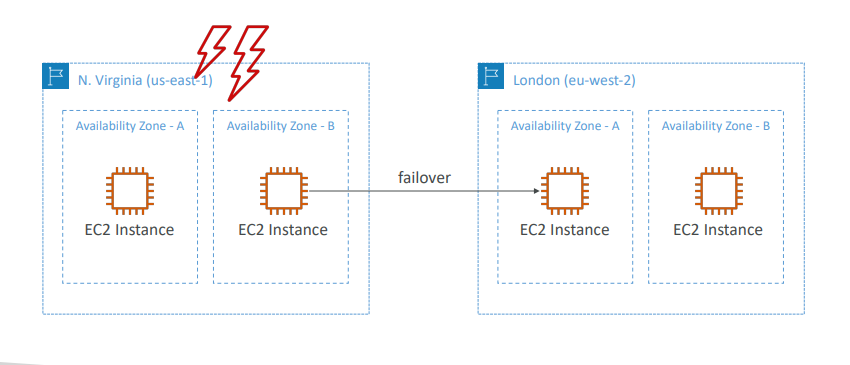

# Advance Identity

## AWS STS (SecurityToken Service)

- Enables you to create **temporary, limited- privileges credentials** to access your AWS resources
- Short-term credentials: you configure expiration period Use cases
  - **Identity federation**: manage user identities in external systems, and provide them with STS tokens to access AWS resources
  - **IAM Roles for cross/same account access**
  - **IAM Roles for Amazon EC2**: provide temporary credentials for EC2 instances to access AWS resources

  

  ## Amazon Cognito (simplified)
- **Identity for your Web and Mobile applications users (potentially millions)**
- Instead of creating them an IAM user, you create a user in Cognito

## What is Microsoft Active Directory (AD)?
- Found on any Windows Server with AD Domain Services
- Database of objects: User Accounts, Computers, Printers, File Shares, Security Groups
- Centralized security management, create account, assign permissions

## AWS Directory Services (no need to know in depth for the exam)
- **AWS Managed Microsoft AD**
  - Create your own AD in AWS, manage users locally, supports MFA
  - Establish “trust” connections with your on- premise AD
- **AD Connector**
  - Directory Gateway (proxy) to redirect to on- premise AD, supports MFA
  - Users are managed on the on-premise AD
- **Simple AD**
  - AD-compatible managed directory on AWS
  - Cannot be joined with on-premise AD

## AWS Single Sign-On (SSO)
- Centrally manage Single SignOn to access multiple accounts and 3rd-party business applications.
- Integrated with AWS Organizations
- Supports SAML 2.0 markup
- Integration with on-premise Active Directory

## AWS Single Sign-On (SSO) – Setup with AD

## Advanced Identity - Summary
- **IAM**
  - Identity and Access Management inside your AWS account
  - For users that you trust and belong to your company
-** Organizations**: manage multiple AWS accounts
- **Security Token Service (STS)**: temporary, limited-privileges credentials to access AWS resources
- **Cognito**: create a database of users for your mobile & web applications
- **Directory Services**: integrate Microsoft Active Directory in AWS
- **Single Sign-On (SSO)**: one login for multiple AWS accounts & application

# Other Services

## Amazon WorkSpaces
- Managed Desktop as a Service (DaaS) solution to easily **provision Windows or Linux desktops**
- **Great to eliminate management of on-premise VDI (Virtual Desktop Infrastructure)**

## Amazon WorkSpaces – Multiple Regions

## Amazon AppStream 2.0

- Desktop Application Streaming Service
- Deliver to any computer, without acquiring, provisioning infrastructure
- The application is delivered from within a web browser

## Amazon AppStream 2.0 vs WorkSpaces
|Workspaces|AppStream 2.0|
|----|----|
|<ul><li>Fully managed VDI and desktop available</li><li>The users connect to the VDI and open native or WAM applications</li><li>Workspaces are on-demand or always on</li></ul>|<ul><li>Stream a desktop application to web browsers (no need to connect to a VDI)</li><li>Works with any device (that has a web browser)</li><li>Allow to configure an instance type per application type (CPU, RAM, GPU)</li></ul>|

## Amazon Sumerian
- **Create and run virtual reality (VR), augmented reality (AR), and 3D applications**
- Can be used to quickly **create 3D models with animations**
- Ready-to-use templates and assets - no programming or 3D expertise required
- Accessible via a web-browser URLs or on popular hardware for AR/VR
- Example: https://docs.aws.amazon.com/sumerian/latest/userguide/gettingstartedshowcase.html

## AWS IoT Core
- IoT stands for “Internet of Things”– the network of internet -connected devices that are able to collect and transfer data
- AWS IoT Core allows you to **easily connect IoT devices to the AWS Cloud** 
- **Serverless, secure & scalable** to billions of devices and trillions of messages
- Your applications can communicate with your devices even when they aren’t connected
- Integrates with a lot of AWS services(Lambda, S3, SageMaker, etc.)
- Build IoT applications that gather, process, analyze, and act on data

## Amazon Elastic Transcoder
- Elastic Transcoder is used to **convert media files stored in S3 into media files in the formats required by consumer playback devices (phones etc..)**
- Benefits:
  - Easy to use
  - Highly scalable – can handle large volumes of media files and large file sizes
  - Cost effective – duration-based pricing model
  - Fully managed & secure, pay for what you use

## AWS AppSync
- Store and sync data across mobile and web apps in real-time
- **Makes use of GraphQL (mobile technology from Facebook)**
- Client Code can be generated automatically
- Integrations with DynamoDB / Lambda
- Real-time subscriptions
- Offline data synchronization (replaces Cognito Sync)
- Fine Grained Security
- AWS Amplify can leverage AWS AppSync in the background!

## AWS Amplify

- A set of tools and services that helps you develop and deploy scalable full stack web and mobile applications
- Authentication, Storage, API (REST, GraphQL), CI/CD, PubSub, Analytics, AI/ML Predictions, Monitoring, Source Code from AWS, GitHub, etc…

## AWS Device Farm
- Fully-managed service that **tests your web and mobile apps against desktop browsers, real mobile devices, and tablets**
- Run tests concurrently on multiple devices (speed up execution)
- Ability to configure device settings (GPS, language, Wi-Fi, Bluetooth, …)

## AWS Backup
- Fully-managed service to centrally manage and automate backups across AWS services
- On-demand and scheduled backups
- Supports PITR (Point-in-time Recovery)
- Retention Periods, Lifecycle Management, Backup Policies, …
- Cross-Region Backup
- Cross-Account Backup (using AWS Organizations)

## Disaster Recovery Stragies

### Backup and Restore

### Pilo Light

### Warm Standby

### Multi-Site/ Hot-site

## Typical DR Setup for Cloud Deployments

## AWS Elastic Disaster Recovery (DRS)
- Quickly and easily **recover** your physical, virtual, and cloud-based servers into AWS
- Example: protect your most critical databases (including Oracle, MySQL, and SQL Server), enterprise apps (SAP), protect your data from ransomware attacks, …
- Continuous block-level replication for your servers

## AWS DataSync

- Move large amount of data from on-premises to AWS
- Can synchronize to: Amazon S3 (any storage classes – including Glacier), Amazon EFS, Amazon FSx for Windows
- Replication tasks can be scheduled hourly, daily, weekly
- The replication tasks are **incremental** after the first full load

## AWS Application Discovery Service
- Plan migration projects by gathering information about on-premises data centers
- Server utilization data and dependency mapping are important for migrations
- Agentless Discovery (AWS Agentless Discovery Connector)
- VM inventory, configuration, and performance history such as CPU, memory, and disk usage
- Agent-based Discovery (AWS Application Discovery Agent)
- System configuration, system performance, running processes, and details of the network connections between systems

|Agentless Discovery (AWS Agentless Discovery Connector)|Agent-based Discovery (AWS Application Discovery Agent)|
|---|---|
|VM inventory, configuration, and performance history such as CPU, memory, and disk usage|System configuration, system performance, running processes, and details of the network
connections between systems|

- Resulting data can be viewed within AWS Migration Hub

## AWS Application Migration Service (MGN)
- Lift-and-shift (rehost) solution which simplify **migrating** applications to AWS
- Converts your physical, virtual, and cloud-based servers to run natively on AWS
- Supports wide range of platforms, Operating Systems, and databases
- Minimal downtime, reduced costs

## AWS Fault Injection Simulator (FIS)

- A fully managed service for running fault injection experiments on AWS workloads
- Based on **Chaos Engineering** – stressing an application by creating disruptive events (e.g., sudden increase in CPU or memory), observing how the system responds, and implementing improvements
- Helps you uncover hidden bugs and performance bottlenecks
- Supports the following AWS services: EC2, ECS, EKS, RDS…
- Use pre-built templates that generate the desired disruptions

## AWS Step Functions

- Build **serverless visual workflow** to orchestrate your Lambda functions
- **Features**: sequence, parallel, conditions, timeouts, error handling, …
- Can integrate with EC2, ECS, On -premises servers, API Gateway, SQS queues, etc…
- Possibility of implementing human approval feature
- **Use cases**: order fulfillment, data processing, web applications, any workflow

## AWS Ground Station
- Fully managed service that lets you control sattelite communications, process data, and scale your satellite operations
- Provides a global network of satellite ground stations near AWS regions
- Allows you to download satellite data to your AWS VPC within seconds
- Send satellite data to S3 or EC2 instance - Use cases: weather forecasting, surface imaging, communications, video broadcasts

## Amazn Pinpoint
- Scalable **2-way (outbound/inbound)** marketing communications service
- Supports email, SMS, push, voice, and in-app messaging
- Ability to segment and personalize messages with the right content to customers
- Possibility to receive replies
- Scales to billions of messages per day
- Use cases: run campaigns by sending marketing, bulk, transactional SMS messages
- **Versus Amazon SNS or Amazon SES**
- In SNS & SES you managed each message's audience, content, and delivery schedule
- In Amazon Pinpoint, you **create message templates, delivery schedules, highly-targeted segments, and full campaigns**

