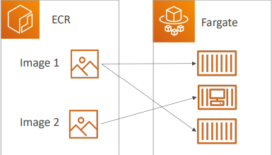

# Cloud Computing

## How Website Works

### What is a server composed of

### IT Terminology

- Network: cables, routers and servers connected with each other
- Router: A networking device that forwards data packets between computer networks. They know where to send your packets on the internet!
- Switch: Takes a packet and send it to the correct server / client on your network

### Cloud Computing

- Cloud computing is the on-demand delivery of compute power, database storage, applications, and other IT resources
- Through a cloud services platform with **pay-as-you-go pricing**
- You can access as many resources as you need, almost **instantly**
- Simple way to access servers, storage, databases and a set of **application services**

#### AWS owns and maintains the network-connected hardware required for these application services, while you provision and use what you need via a web application.

### the Deployment Models of the Cloud

<table>
<tr>
    <td>Private Cloud</td>
    <td>Cloud services used by a
single organization, not
exposed to the public.</td>
    <td>Complete control</td>
    <td>Security for sensitive
applications</td>
    <td>Meet specific business
needs</td>
   <td>ex: rackspace</td>
</tr>
<tr>
    <td>Public Cloud</td>
    <td>Cloud resources owned
and operated by a third-
party cloud service provider delivered over
the Internet.</td>
   <td> Six Advantages of Cloud
Computing</td>
   <td>ex: Dropbox, AWS, GoogleCloud</td>
</tr>
<tr>
    <td>Hybrid Cloud</td>
    <td>Keep some servers on
premises and extend
some capabilities to the
Cloud</td>
     <td>Control over sensitive
assets in your private
infrastructure</td>
     <td>Flexibility and cost-
effectiveness of the
public cloud</td>
     <td>ex: your own database -> <- AWS</td>
</tr>
</table>

### 5 Characteristics of Cloud Computing

| On-demand self service                                                                        | Broad network access                                                                                       | Multi-tenancy and resource pooling                                                                                                                      | Rapid elasticity and scalability                                                                                              | Measured service                                                        |
| --------------------------------------------------------------------------------------------- | ---------------------------------------------------------------------------------------------------------- | ------------------------------------------------------------------------------------------------------------------------------------------------------- | ----------------------------------------------------------------------------------------------------------------------------- | ----------------------------------------------------------------------- |
| Users can provision resources and use them without human interaction from the service provide | <ul><li>Resources available over the network</li><li>can be accessed by diverse client platforms</li></ul> | Multiple customers can share the same infrastructure and applications with security and privacy.Customers are serviced from the same physical resources | <ul> <li>Automatically and quickly acquire and dispose resources when needed</li><li>Quickly and easily scale based on demand | Usage is measured</li></ul> users pay correctly for what they have used |

### 6 Advantages of Cloud Computing

| Trade capital expense (CAPEX) for operational expense (OPEX)                                                                   | Benefit from massive economies of scale                        | Stop guessing capacity               | Increase speed and agility  | Stop spending money running and maintaining data centers | Go global in minutes                   |
| ------------------------------------------------------------------------------------------------------------------------------ | -------------------------------------------------------------- | ------------------------------------ | --------------------------- | -------------------------------------------------------- | -------------------------------------- |
| <ul><li>Pay On-Demand: don’t own hardware</li><li>Reduced Total Cost of Ownership (TCO) & Operational Expense (OPEX)</li></ul> | Prices are reduced as AWS is more efficient due to large scale | Scale based on actual measured usage | Increase speead and agility | Stop spending money running and maintaining data centers | leverage the AWS global infrastructure |

### Types of Cloud Computing

<table>
  <tbody>
    <tr>
      <th>Infrastructure as a Service (IaaS)</th>
      <th align="center"> Platform as a Service (PaaS)</th>
      <th align="right">Software as a Service (SaaS)</th>
    </tr>
    <tr>
      <td>
      <ul>
        <li>Provide building blocks for cloud IT</li>
        <li>Provides networking, computers, data storage space</li>
        <li>Highest level of flexibility</li>
          <li> Easy parallel with traditional on-premises IT</li>
      <ul>
      </td>
      <td align="center">
        <ul>
        <li>Removes the need for your organization to manage the underlying infrastructure</li>
        <li>Focus on the deployment and management of your applications</li>
      <ul>
      </td>
      <td align="right">Completed product that is run and managed by the service provider</td>
    </tr>
  </tbody>
</table>

### Pricing of the Cloud - Quick Overview

- AWS has 3 pricing fundamentals, following pay-as-you-go pricing model
- **Compute:**Pay for compute time
- **Storage:**Pay for data stored in the Cloud
- **Data transfer OUT of the Cloud:**Data transfer IN is free
- Solves the expensive issue of traditional IT

## AWS Overview

### Cloud History

### AWS Cloud Use Cases

- AWS enables you to build sophisticated, scalable applications
- Aplicable to a diverse set of industries
- Use cases include
  - Enterprise IT, backup & storage, Big data analytics,
  - Web hosting, Mobile & Social Apps

#### AWS Global Infrastructure

- AWS Regions
- AWS Availability Zones
- AWS Data Centers
- AWS Edge Locations /
  Points of Presence

-> checkout infrastructure.aws

### AWS Regions

- AWS has Regions all around the world
- Names can be us-east-1, eu-west-3...
- A region is a **cluster of data centers**
- **Most AWS services are region-scoped**.So if you switch region, it will be refreshed

### How to choose AWS region

- Compliance with data governance and legal
  requirements: data never leaves a region without
  your explicit permission
- Proximity to customers: reduced latency. If you use different target region -> lagging
- Available services within a Region: new services
  and new features aren’t available in every Region
  -Pricing: pricing varies region to region and is
  transparent in the service pricing page

|   Compliance with data governance and legal requirements    |    Proximity to customers    |               Available services within a Region               |                                    Pricing                                     |
| :---------------------------------------------------------: | :--------------------------: | :------------------------------------------------------------: | :----------------------------------------------------------------------------: |
| data never leaves a region without your explicit permission | reduced latency (reduce lag) | new services and new features aren’t available in every Region | pricing varies region to region and is transparent in the service pricing page |

### Availablity zones

- Each region has many (usually 3, min is 2, max is 6). Example:

  - ap-southeast-2a
  - ap-southeast-2b
  - ap-southeast-2c

- Each availability zone (AZ) is one or more
  discrete data centers with redundant power,
  networking, and connectivity
  -They’re separate from each other, so that
  they’re isolated from disasters
- They’re connected with high bandwidth,
  ultra-low latency networking

### AWS Points of Presence (Edge Locations)

- Amazon has 216 points of presence (205 Edge Locations & || Regional Caches) in 84 cities across 42 countries
- Content is delivered to end users with lower latency

### Tour of AWS Console

### Shared Responsibility Model diagram

## IAM - Users & Groups

- AM = Identity and Access Management, Global service
- Root account created by default, shouldn’t be used or shared
- Users are people within your organization, and can be grouped

- **Groups only contain users, not other groups**
- Users don’t have to belong to a group, and user can belong to multiple groups

### IAM: Permissions

- Users or Groups can be
  assigned JSON documents
  called policies
- These policies define the permissions of the users
- In AWS you apply the least privilege principle: don’t give more permissions than a user needs. Ex: users can use uneccessary services-> cost and not secured

### IAM Policies inheritance

### IAM Policies Structure

- Consist of:

  - Version: policy language version, always include "2012-10-17"
  - Id: an identifier for the policy
  - Statement: one or more individual statements (required)
    - Sid: an identifier for the statement
    - Effect: whether the statement allows or denies access (Allow, Deny)
    - Principal: account/user/role to which this policy applied to
    - Action: list of actions this policy allows or denies
    - Resource: list of resources to which this actions applied to
    - Condition: conditions for when this policy is in effect (optional)

  

### Password Policy

- Strong passwords = higher security for your account
  - In AWS, you can setup a password policy:
  - Set a minimum password length
  - Require specific character types:
    - including uppercase letters
    - lowercase letters
    - numbers
    - non-alphanumeric characters
- Allow all IAM users to change their own passwords
- Require users to change their password after some time (password expiration)
- Prevent password re-use

### Multi Factor Authentication - MFA

- Users have access to your account and can possibly change configurations or delete resources in your AWS account
- **You want to protect your Root Accounts and IAM users**

- Main benefit of MFA: **if a password is stolen or hacked, the account is not compromised**

### MFAA devices options in AWS

### How can users access AWS?

- To access AWS, you have three options:
  - AWS Management Console (protected by password + MFA)
  - AWS Command Line Interface (CLI): protected by access keys
  - AWS Software Developer Kit (SDK) - for code: protected by access keys
- Access Keys are generated through the AWS Console
- Users manage their own access keys
- Access Keys are secret, just like a password. Don’t share them
- Access Key ID ~= username
- Secret Access Key ~= password

#### AWS CLI

- A tool that enables you to interact with AWS services using commands in
  your command-line shell
- Direct access to the public APIs of AWS services
- You can develop scripts to manage your resources
- It’s open-source https://github.com/aws/aws-cli
- Alternative to using AWS Management Console

### AWS SDK

- AWS Software Development Kit (AWS SDK)
- Language-specific APIs (set of libraries)
- Enables you to access and manage AWS services
  programmatically
- Embedded within your application
- Supports

  - SDKs (JavaScript, Python, PHP, .NET, Ruby, Java, Go, Node.js,
    C++)
  - Mobile SDKs (Android, iOS, …)
  - IoT Device SDKs (Embedded C, Arduino, …)

- AWS CLI is built on AWS SDK for Python

### IAM Roles for Services

- Some AWS service will need to perform actions on your behalf
- To do so, we will assign permissions to AWS services
  with IAM Roles
- Common roles:

  - EC2 Instance Roles
  - Lambda Function Roles
  - Roles for CloudFormation

  

### IAM Security Tools

- IAM Credentials Report (account-level)

  - a report that lists all your account's users and the status of their various
    credentials

- IAM Access Advisor (user-level)
  - Access advisor shows the service permissions granted to a user and when those
    services were last accessed.
  - You can use this information to revise your policies

### IAM Guidlines & Best Practices

- Don't use the root account except for AWS account setup
- One physical user = One AWS user
- Assign users to groups and assign permissions to group
- Create a strong password policy
- Use and enforce the use of Multi Factor Authentication (MFA)
- Create and use Roles for giving permissions to AWS services
- Use Access Keys for Programmatic Access (CLI / SDK)
- Audit permissions of your account with the IAM Credentials Report
- Never share IAM users & Access Keys

### Shared Responsibilitiy Model for IAM

## Summary - IAM Section

- **Users**: mapped to a physical user, has a password for AWS Console
- **Groups**: contains users only
- **Policies**: JSON document that outlines permissions for users or groups
- **Roles**: for EC2 instances or AWS services
- **Security**: MFA + Password Policy
- **AWS CLI**: manage your AWS services using the command-line
- **AWS SDK**: manage your AWS services using a programming language
- **Access Keys**: access AWS using the CLI or SDK
- **Audit**: IAM Credential Reports & IAM Access Advisor

### EC2 Instance Storage Section

- An EBS (Elastic Block Store) Volume is a network drive you can attach to your instances while they run
- It allows your instances to persist data, even after their termination
- They can only be mounted to one instance at a time (at the CCP level)
- They are bound to a specific availability zone
- Analogy: Think of them as a “network USB stick”
- Free tier: 30 GB of free EBS storage of type General Purpose (SSD) or Magnetic per month

### EBS Volume

- It’s a network drive (i.e. not a physical drive)
  - It uses the network to communicate the instance, which means there might be a bit of latency
  - It can be detached from an EC2 instance and attached to another one quickly
- It’s locked to an Availability Zone (AZ)
  - An EBS Volume in us-east-1a cannot be attached to us-east-1b
  - To move a volume across, you first need to snapshot it
- Have a provisioned capacity (size in GBs, and IOPS)
  - You get billed for all the provisioned capacity
  - You can increase the capacity of the drive over time

### EBS Overview

### EBS – Delete on Termination attribute

- Controls the EBS behaviour when an EC2 instance terminates
  - By default, the root EBS volume is deleted (attribute enabled)
  - By default, any other attached EBS volume is not deleted (attribute disabled)
- This can be controlled by the AWS console / AWS CLI
- **Use case: preserve root volume when instance is terminated**

### EBS Snapshots

- Make a backup (snapshot) of your EBS volume at a point in time
- Not necessary to detach volume to do snapshot, but recommended
- Can copy snapshots across AZ or Region

### EBS Snapshots

- EBS Snapshot Archive

  - Move a snapshot to an "archive tier" that is 75% cheaper
  - Takes within 24 to 72 hours for restoring the archive

- Recycle Bin for EBD Snapshots
  - Setup rules to retain deleted snapshots so you can recover them after an accidental deletion
  - Specify retention (from 1 day to 1 year)

### AMI Overview

- AMI = Amazon Machine Image
- **AMI are a customization of an EC2 instance**
- You add your own software, configuration, operating system, monitoring…
- Faster boot / configuration time because all your software is pre-packaged
- AMI are built for a specific region (and can be copied across regions)
- You can launch EC2 instances from:
  - A Public AMI: AWS provided
  - Your own AMI: you make and maintain them yourself
  - An AWS Marketplace AMI: an AMI someone else made (and potentially sells)

### EC2 Image Builder

- Used to automate the creation of Virtual Machines or container images
- => Automate the creation, maintain, validate and test EC2 AMIs
- Can be run on a schedule (weekly, whenever packages are updated, etc…)
- Free service (only pay for the underlying resources)

### EC2 Instance Store

- EBS volumes are network drives with good but “limited” performance
- If you need a high-performance hardware disk, use EC2 Instance Store
- Better I/O performance
- EC2 Instance Store lose their storage if they’re stopped (ephemeral)
- Good for buffer / cache / scratch data / temporary content
- Risk of data loss if hardware fails
- Backups and Replication are your responsibility

### Local EC2 Instance Store (high performance hardware attached volume)

### EFS - Elastic File System

- Managed NFS (network file system) that can be mounted on 100s of EC2
- EFS works with Linux EC2 instances in multi-AZ
- Highly available, scalable, expensive (3x gp2), pay per use, no capacity planning

### Difference between EBS vs EFS

| EBS                                                                                                               | EFS                                                                              |
| ----------------------------------------------------------------------------------------------------------------- | -------------------------------------------------------------------------------- |
| To transfer EBS to different AZ, you have to make a copy of it (EBS snapshot), and restore that copy to wanted AZ | EFS makes a shared file system. All instances in AZs and mount the same EFS file |

### Shared Responsibility Model for EC2 Storage

| AWS                                                                                                                                                                                   | User                                                                                                                                                                                                     |
| ------------------------------------------------------------------------------------------------------------------------------------------------------------------------------------- | -------------------------------------------------------------------------------------------------------------------------------------------------------------------------------------------------------- |
| <ul><li>Infrastructure</li><li>Replication for data for EBS volumes & EFS drives</li><li>Replacing faulty hardware</li><li>Ensuring their employees cannot access your data</li></ul> | <ul><li>Setting up backup / snapshot procedures</li><li>Setting up data encryption</li><li>Responsibility of any data on the drives</li><li>Understanding the risk of using EC2 Instance Store</li></ul> |

### Amazon FSx – Overview

- Launch 3rd party high-performance file systems on AWS
- Fully managed service. ex: FSx for Lustre, FSx for Windows File Server, FSx for NetApp ONTAP

### Amazon FSx for windows File Server

- A fully managed, high reliable, and scalable **Windows native** shared file system
- Built on Windows File Server
- Supports SMB protocol & Windows NTFS
- Integrated with Microsoft Active Directory
- Integrated with Microsoft Active Directory
- Can be accessed from AWS or your on-premise infrastructure

### Amazon FSx for Lustre

- A fully managed, high-performance, scalable file storage for High Performance Computing (HPC)
- The name Lustre is derived from “Linux” and “cluster”
- Machine Learning, Analytics, Video Processing, Financial Modeling, …
- Scales up to 100s GB/s, millions of IOPS, sub-ms latencies

### EC2 Instance Storage - Summary

- EBS volumes:
  - Network drives attached to one EC2 instance at a time
  - Mapped to an Availability Zones
  - Can use EBS Snapshots for backups / transferring EBS volumes across AZ
- AMI: create ready-to-use EC2 instances with our customizations
- EC2 Image Builder: automatically build, test and distribute AMIs
- EC2 Instance Store:
  - High performance hardware disk attached to our EC2 instance
  - Lost if our instance is stopped / terminated
- EFS: network file system, can be attached to 100s of instances in a region
- EFS-IA: cost-optimized storage class for infrequent accessed files
- FSx for Windows: Network File System for Windows servers
- FSx for Lustre: High Performance Computing Linux file system

# ELB & ASG - ElasticLoad Balancing & Auto Scaling Groups

## Elastic Load Balancing & Auto Scaling Groups

- Scalability means that an application / system can handle greater loads by adapting.
- There are two kinds of scalability:
  - Vertical Scalability
  - Horizontal Scalability (= elasticity)
- Scalability is linked but different to High Availability

### Vertical Scalability

- Vertical Scalability means increasing the size of the instance
- For example, your application runs on a t2.micro
- Scaling that application vertically means running it on a t2.large
- Vertical scalability is very common for non distributed systems, such as a database.
- There’s usually a limit to how much you can vertically scale (hardware limit)

### Horizontal Scalability

- Horizontal Scalability means increasing the number of instances / systems for your application
- Horizontal scaling implies distributed systems
- This is very common for web applications / modern applications
- It’s easy to horizontally scale thanks the cloud offerings such as Amazon EC2

### High Availability

- High Availability usually goes hand in hand with horizontal scaling
- High availability means running your application / system in at least 2 Availability Zones
- The goal of high availability is to survive a data center loss (disaster)

### High Availability & Scalability for EC2

- Vertical Scaling: Increase instance size (= scale up / down)
- From: t2.nano - 0.5G of RAM, 1 vCPU
- To: u-12tb1.metal – 12.3 TB of RAM, 448 vCPUs
- Horizontal Scaling: Increase number of instances (= scale out / in)
  - Auto Scaling Group
  - Load Balancer
- High Availability: Run instances for the same application across multi AZ
  - Auto Scaling Group multi AZ
  - Load Balancer multi AZ

### Scalability vs Elasticity (vs Agility)

- Scalability: ability to accommodate a larger load by making the hardware stronger (scale up), or by adding nodes (scale out)
- Elasticity: once a system is scalable, elasticity means that there will be some “auto-scaling” so that the system can scale based on the load. This is “cloud-friendly”: pay-per-use, match demand, optimize costs
- Agility: (not related to scalability - distractor) new IT resources are only a click away, which means that you reduce the time to make those resources available to your developers from weeks to just minutes

### Load Balancing

- Load balancers are servers that forward internet traffic to multiple servers (EC2 Instances) downstream.

### Why use Load balancer

- Spread load across multiple downstream instances
- Expose a single point of access (DNS) to your application
- Seamlessly handle failures of downstream instances
- Do regular health checks to your instances
- Provide SSL termination (HTTPS) for your websites
- High availability across zones

### Why use an Elastic Load Balancer

- An ELB (Elastic Load Balancer) is a managed load balancer
  - AWS guarantees that it will be working
  - AWS takes care of upgrades, maintenance, high availability
  - AWS provides only a few configuration knobs
- It costs less to setup your own load balancer but it will be a lot more effort on your end (maintenance, integrations)
- 3 kinds of load balancers offered by AWS:
  - Gateaway Load Balancer (will be covered later)
  - Application Load Balancer (HTTP / HTTPS only) – Layer 7
  - Network Load Balancer (ultra-high performance, allows for TCP) – Layer 4 ( lower network than http)
  - Classic Load Balancer (slowly retiring) – Layer 4 & 7

### Auto Scaling Group

- In real-life, the load on your websites and application can change. Ex: load will be increased during the day, less at night
- In the cloud, you can create and get rid of servers very quickly
- The goal of an Auto Scaling Group (ASG) is to:
  - Scale out (add EC2 instances) to match an increased load
  - Scale in (remove EC2 instances) to match a decreased load
  - Ensure we have a minimum and a maximum number of machines running
  - Automatically register new instances to a load balancer
  - Replace unhealthy instances
- Cost Savings: only run at an optimal capacity (principle of the cloud)

### Auto Scaling Groups - Scaling Strategies

- Manual Scaling: Update the size of an ASG manually
- Dynamic Scaling: Respond to changing demand
  - Simple / Step Scaling
    - When a CloudWatch alarm is triggered (example CPU > 70%), then add 2 units
    - When a CloudWatch alarm is triggered (example CPU < 30%), then remove 1
- Target Tracking Scaling
  - Example: I want the average ASG CPU to stay at around 40%
- Scheduled Scaling
  - Anticipate a scaling based on known usage patterns
  - Example: increase the min. capacity to 10 at 5 pm on Friday

### Auto Scaling Groups – Scaling Strategies

- Predictive Scaling
  - Uses Machine Learning to predict future traffic ahead of time
  - Automatically provisions the right number of EC2 instances in advance
- Useful when your load has predictable time-based patterns

- High Availability vs Scalability (vertical and horizontal) vs Elasticity vs Agility in the Cloud
- Elastic Load Balancers (ELB)
  - Distribute traffic across backend EC2 instances, can be Multi-AZ
  - Supports health checks
  - 3 types: Application LB (HTTP – L7), Network LB (TCP – L4), Classic LB (old)
- Auto Scaling Groups (ASG)

  - Implement Elasticity for your application, across multiple AZ
  - Scale EC2 instances based on the demand on your system, replace unhealthy
  - Integrated with the ELB

  ## S3

### Section introduction

- Amazon S3 is one of the main building blocks of AWS
- It’s advertised as ”infinitely scaling” storage

- Many websites use Amazon S3 as a backbone
- Many AWS services use Amazon S3 as an integration as well
- We’ll have a step-by-step approach to S3
- The CCP exam requires “deeper” knowledge about S3

### S3 Use cases

- Backup and storage
- Disaster Recovery
- Archive
- Hybrid Cloud storage
- Application hosting
- Media hosting
- Data lakes & big data analytics
- Software delivery
- Static website

### Amazon S3 Overview -Buckets

- Amazon S3 allows people to store objects (files) in “buckets” (directories)
- Buckets must have a globally unique name (across all regions all accounts)
- Buckets are defined at the region level
- S3 looks like a global service but buckets are created in a region
- Naming convention
  - No uppercase
  - No underscore
  - 3-63 characters long
  - Not an IP
  - Must start with lowercase letter or number

### Amazon S3 Overview - Objects

- Objects (files) have a Key
- The key is the FULL path:
  - s3://my-bucket/my_file.txt
  - s3://my-bucket/my_folder1/another_folder/my_file.txt
- The key is composed of prefix + object name
  -ex : s3://my-bucket/my_folder1/another_folder/my_file.txt
- There’s no concept of “directories” within buckets (although the UI will trick you to think otherwise)
- Just keys with very long names that contain slashes (“/”)

- Object values are the content of the body:
- Max Object Size is 5TB (5000GB)
- If uploading more than 5GB, must use “multi-part upload”
- Metadata (list of text key / value pairs – system or user metadata)
- Tags (Unicode key / value pair – up to 10) – useful for security / lifecycle
- Version ID (if versioning is enabled)

### S3 Security

- User based
  - IAM policies - which API calls should be allowed for a specific user from IAM console
- Resource Based
  - which API calls should be allowed for a specific user from IAM console
- Note: an IAM principal can access an S3 object if
  - the user IAM permissions allow it OR the resource policy ALLOWS it
  - AND there’s no explicit DENY
- Encryption: encrypt objects in Amazon S3 using encryption keys

#### Example of S3 security

1. Public Access - Use Bucket Policy

2. User Access to S3 - – IAM permissions

3. EC2 instance access - User IAM roles

4. Advanced: Cross-Account Access – Use Bucket Policy

### S3 Bucket Policies

- JSON based policies
  - Resources: buckets and objects
  - Actions: Set of API to Allow or Deny
  - Effect: Allow / Deny
  - Principal: The account or user to apply the policy to
- Use S3 bucket for policy to:

  - Grant public access to the bucket
  - Force objects to be encrypted at upload
  - Grant access to another account (Cross Account)

  

### Bucket settings for Block Public Access

- These settings were created to prevent company data leaks
- If you know your bucket should never be public, leave these on
- Can be set at the account leve

### S3 Websites Overview

- S3 can host static websites and have them accessible on the www
- The website URL will be:
  - <bucket-name>.s3-website-<AWS-region>.amazonaws.com OR
  - <bucket-name>.s3-website.<AWS-region>.amazonaws.com
- **If you get a 403 (Forbidden) error, make sure the bucket policy allows public reads!**

### S3 Versioning Overview

- You can version your files in Amazon S3
- It is enabled at the bucket level
- Same key overwrite will increment the “version”: 1, 2, 3
- It is best practice to version your buckets
  - Protect against unintended deletes (ability to restore a version)
  - Easy roll back to previous version
- Notes:
  - Any file that is not versioned prior to enabling versioning will have version “null”
  - Suspending versioning does not delete the previous versions

### S3 Access Logs

- For audit purpose, you may want to log all access to S3 buckets
- Any request made to S3, from any account, authorized or denied, will be logged into another S3 bucket
- That data can be analyzed using data analysis tools…
- Very helpful to come down to the root cause of an issue, or audit usage, view suspicious patterns, etc…

- For audit purpose, you may want to log all access to S3buckets
- Any request made to S3, from any account, authorized or denied, will be logged into another S3 bucket
- That data can be analyzed using data analysis tools…
- Very helpful to come down to the root cause of an issue, or audit usage, view suspicious patterns, etc…

### S3 Replication (CRR & SRR)

- Must enable versioning in source and destination
- Cross Region Replication (CRR)
- Same Region Replication (SRR)
- Buckets can be in different accounts
- Copying is asynchronous
- Must give proper IAM permissions to S3
- CRR - Use cases: compliance, lower latency access, replication across accounts
- SRR – Use cases: log aggregation, live replication between production and test accounts

### S3 Storage Classes

- Amazon S3 Standard - General Purpose
- Amazon S3 Standard-Infrequent Access (IA)
- Amazon S3 One Zone-Infrequent Access
- Amazon S3 Glacier Instant Retrieval
- Amazon S3 Glacier Flexible Retrieval
- Amazon S3 Glacier Deep Archive
- Amazon S3 Intelligent Tiering

- Can move between classes manually or using S3 Lifecycle configurations

### S3 Durability and Availability

- Durability:
  - High durability (99.999999999%, 11 9’s) of objects across multiple AZ
  - If you store 10,000,000 objects with Amazon S3, you can on average expect to incur a loss of a single object once every 10,000 years
  - Same for all storage classes
- Availability:
  - Measures how readily available a service is
  - Varies depending on storage class
  - Example: S3 standard has 99.99% availability = not available 53 minutes a year

### S3 Standard - General Purpose

- 99.99% Availability
- Used for frequently accessed data
- Low latency and high throughput
- Sustain 2 concurrent facility failures
- Use Cases: Big Data analytics, mobile & gaming applications, content distribution…

### S3 Storage Classes – Infrequent Access

- For data that is less frequently accessed, but requires rapid access when needed
- Lower cost than S3 Standard

| Amazon S3 Standard-Infrequent Access (S3 Standard-IA) | Amazon S3 One Zone-Infrequent Access (S3 One Zone-IA                                               |
| ----------------------------------------------------- | -------------------------------------------------------------------------------------------------- |
| 99.9% Availability                                    | High durability (99.999999999%) in a single AZ; data lost when AZ is destroyed. 99.5% Availability |
|                                                       |
| Use cases: Disaster Recovery, backups                 | Use Cases: Storing secondary backup copies of on-premise data, or data you can recreate            |

### Amazon S3 Glacier Storage Classes

- Low-cost object storage meant for archiving / backup
- Pricing: price for storage + object retrieval cost

| Amazon S3 Glacier Instant Retrieval                                                                                         | Amazon S3 Glacier Flexible Retrieval (formerly Amazon S3 Glacier)                                                                              | Amazon S3 Glacier Deep Archive – for long term storage                                              |
| --------------------------------------------------------------------------------------------------------------------------- | ---------------------------------------------------------------------------------------------------------------------------------------------- | --------------------------------------------------------------------------------------------------- |
| <ul><li>Millisecond retrieval, great for data accessed once a quarter</li><li>Minimum storage duration of 90 days</li></ul> | <ul><li>Expedited (1 to 5 minutes), Standard (3 to 5 hours), Bulk (5 to 12 hours) – free</li><li>Minimum storage duration of 90 days</li></ul> | <ul><li>Standard (12 hours), Bulk (48 hours)</li><li>Minimum storage duration of 180 days</li></ul> |

### S3 Intelligent-Tiering

- Small monthly monitoring and auto-tiering fee
- Moves objects automatically between Access Tiers based on usage
- There are no retrieval charges in S3 Intelligent-Tiering

- Frequent Access tier (automatic): default tier
- Infrequent Access tier (automatic): objects not accessed for 30 days
- Archive Instant Access tier (automatic): objects not accessed for 90 days
- Archive Access tier (optional): configurable from 90 days to 700+ days
- Deep Archive Access tier (optional): config. from 180 days to 700+ days

### S3 Object Lock & Glacier Vault Lock

- S3 Object Lock
  - Adopt a WORM (Write Once Read Many) model
  - Block an object version deletion for a specified amount of time
- Glacier Vault Lock
  - Adopt a WORM (Write Once ReadMany) model
  - Lock the policy for future edits (can no longer be changed)
  - Helpful for compliance and data retention

### S3 Encryption

- No Encryption
- Server-side Encryption
- Client-side Encryption

### Shared Rresponsibility Model for s3

| AWS | USER |
| --- | ---- |

| <ul><li>Infrastructure (global security,
durability, availability, sustain
concurrent loss of data in
two facilities) </li><li>Configuration and
vulnerability analysis</li><li>Compliance validation

</li></ul>   | <ul><li>S3 Versioning</li><li>S3 Bucket Policies</li><li>S3 Replication Setup</li><li> Logging and Monitoring</li><li>S3 Storage Classes</li><li>Data encryption at rest and in
transit</li></ul>    |

### AWS Snow Family

- Highly-secure, portable devices to collect and process data at the edge, and migrate data into and out of AWS
- Data migration:
  - Snowcone
  - Snowball Edge
  - Snowmobile

- Edge Computing:
- Snowcone
- Snowball Edge
  

### Why use Data Migration with AWS Snow Family

- Challenges:
  - Limited connectivity
  - Limited bandwidth
  - High network cost
  - Shared bandwidth (can’t maximize the line)
  - Connection stability

- That's when AWS Sow Family comes in: **offline devices to perform data migrations**
- If it takes more than a week to transfer over the network, use Snowball devices!

#### Diagrams

### Snowball Edge (for data transfers)
- Physical data transport solution: move TBs or PBs of data in or out of AWS
- Alternative to moving data over the network (and paying network fees)
- Pay per data transfer job
- Provide block storage and Amazon S3-compatible object storage
- Snowball Edge Storage Optimized  
  - 80 TB of HDD capacity for block volume and S3 compatible object storage
- Snowball Edge Compute Optimized  
  - 42 TB of HDD capacity for block volume and S3 compatible object storage
- Use cases: large data cloud migrations, DC decommission, disaster recovery

### AWS Snowcone
- Small, portable computing, anywhere, rugged & secure, withstands harsh environments
- Light (4.5 pounds, 2.1 kg) • Device used for edge computing, storage, and data transfer
- 8 TBs of usable storage 
- Use Snowcone where Snowball does not fit (space-constrained environment)
-  Must provide your own battery / cables 
- Can be sent back to AWS offline, or connect it to internet and use AWS DataSync to send data

### AWS Snowmobile ( like a truck)
- Transfer exabytes of data (1 EB = 1,000 PB = 1,000,000 TBs)
- Each Snowmobile has 100 PB of capacity (use multiple in parallel)
- High security: temperature controlled, GPS, 24/7 video surveillance
- Better than Snowball if you transfer more than 10 PB

### Snow Family – Usage Process
1. Request Snowball devices from the AWS console for delivery
2. Install the snowball client / AWS OpsHub on your servers
3. Connect the snowball to your servers and copy files using the client
4. Ship back the device when you’re done (goes to the right AWS facility)
5. Data will be loaded into an S3 bucket
6. Snowball is completely wiped

### What is Edge Computing
- Process data while it’s being created on an edge location (no access to internet)
  - Ex: A truck on the road, a ship on the sea, a mining station underground... 
- These locations may have
  - Limited / no internet access
  - Limited / no easy access to computing power
- We setup a Snowball Edge / Snowcone device to do edge computing
- Use cases of Edge Computing:
  - Preprocess data
  - Machine learning at the edge
  - Transcoding media streams
- Eventually (if need be) we can ship back the device to AWS (for transferring data for example)

### Snow Family – Edge Computing 
- Snowcone (smaller)
  - 2 CPUs, 4 GB of memory, wired or wireless access
  - USB-C power using a cord or the optional battery
- Snowball Edge – Compute Optimized
  - 52 vCPUs, 208 GiB of RAM
  - Optional GPU (useful for video processing or machine learning)
  - 42 TB usable storage
- Snowball Edge – Storage Optimized
  - Up to 40 vCPUs, 80 GiB of RAM
  - Object storage clustering available
- All: Can run EC2 Instances & AWS Lambda functions (using AWS IoT Greengrass)
- Long-term deployment options: 1 and 3 years discounted pricing

### AWS OpsHub
- Historically, to use Snow Family devices, you needed a CLI (Command Line Interface tool)
- Today, you can use AWS OpsHub (a software you install on your computer / laptop) to manage your Snow Family Device
  - Unlocking and configuring single or clustered devices
  - Transferring files
  - Launching and managing instances running on Snow
  Family Devices
  - Monitor device metrics (storage capacity, active
  instances on your device)
  - Launch compatible AWS services on your devices
  (ex: Amazon EC2 instances, AWS DataSync, Network File System (NFS))

### Hybrid Cloud for Storage
- AWS is pushing for ”hybrid cloud”
 - Part of your infrastructure is on-premises
 - Part of your infrastructure is on the cloud
- This can be due to 
  - Long cloud migrations
  - Security requirements
  - Compliance requirements
  - IT strategy
- S3 is a proprietary storage technology (unlike EFS / NFS), so how do you expose the S3 data on-premise?
- AWS Storage Gateway!

### AWS Storage Cloud Native Options

### AWS Storage Gateway
- Bridge between on-premise data and cloud data in S3
- Hybrid storage service to allow on- premises to seamlessly use the AWS Cloud
- Use cases: disaster recovery, backup & restore, tiered storage
- Types of Storage Gateway:
  - File Gateway
  - Volume Gateway
  - Tape Gateway
- No need to know the types at the exam

### AWS S3- Summary
- Buckets vs Objects: global unique name, tied to a region
- S3 security: IAM policy, S3 Bucket Policy (public access), S3 Encryption
- S3 Websites: host a static website on Amazon S3
- S3 Versioning: multiple versions for files, prevent accidental deletes
- S3 Access Logs: log requests made within your S3 bucket
- S3 Replication: same-region or cross-region, must enable versioning
- S3 Storage Classes: Standard, IA, 1Z-IA, Intelligent, Glacier, Glacier Deep Archive
- S3 Lifecycle Rules: transition objects between classes
- S3 Glacier Vault Lock / S3 Object Lock: WORM (Write Once Read Many)
- Snow Family: import data onto S3 through a physical device, edge computing
- OpsHub: desktop application to manage Snow Family devices
- Storage Gateway: hybrid solution to extend on-premises storage to S3

# Database Intro
- Storing data on disk (EFS, EBS, EC2 Instance Store, S3) can have its limits 
- Sometimes, you want to store data in a database…
  - You can structure the data
  - You build indexes to efficiently query / search through the data
  - You define relationships between your datasets

- Databases are **optimized for a purpose** and come with different features, shapes and constraints

### Relational Databases
- Looks just like Excel spreadsheets, with links between them!
- Can use the SQL language to perform queries / lookups

### NoSQL Databases
- NoSQL = non-SQL = non relational databases
- NoSQL databases are purpose built for specific data models and have flexible schemas for building modern applications.
- Benefits:
  - Flexibility: easy to evolve data model
  - Scalability: designed to scale-out by using distributed clusters
  - High-performance: optimized for a specific data model
  - Highly functional: types optimized for the data model
- Ex:: Key-value, document, graph, in-memory, search databases

### NoSQL data example: JSON
- JSON = JavaScript Object Notation
- JSON is a common form of data that fits into a NoSQL model
- Data can be nested
- Fields can change over time
- Support for new types: arrays, etc…

### Databases & Shared Responsibility on AWS
- AWS offers use to manage different databases
- Benefits include: 
  - Quick Provisioning, High Availability, Vertical and Horizontal Scaling
  - Automated Backup & Restore, Operations, Upgrades
  - Operating System Patching is handled by AWS
  - Monitoring, alerting
- Note: many databases technologies could be run on EC2, but you must handle yourself the resiliency, backup, patching, high availability, fault tolerance, scaling… 

### AWS RDS Overview
- RDS stands for Relational Database Service
- It’s a managed DB service for DB use SQL as a query language
- It allows you to create databases in the cloud that are managed by AWS
  - Postgres
  - MySQL
  - MariaDB
  - Oracle
  - Microsoft SQL Server
  - Aurora (AWS Proprietary database)

### Advantage over using RDS versus deploying DB on EC2

- RDS is a managed service:
  - Automated provisioning, OS patching
  - Continuous backups and restore to specific timestamp (Point in Time Restore)!
  - Monitoring dashboards
  - Read replicas for improved read performance
  - Multi AZ setup for DR (Disaster Recovery)
  - Maintenance windows for upgrades
  - Scaling capability (vertical and horizontal)
  - Storage backed by EBS (gp2 or io1)
- BUT you can’t SSH into your instances

### RDS Solution Architecture 

### Amazon Aurora
- Aurora is a proprietary technology from AWS (not open sourced)
- PostgreSQL and MySQL are both supported as Aurora DB 
- Aurora is “AWS cloud optimized” and claims 5x performance improvement over MySQL on RDS, over 3x the performance of Postgres on RDS
- Aurora storage automatically grows in increments of 10GB, up to 64 TB.
- Aurora costs more than RDS (20% more) – but is more efficient 
- Not in the free tier

### Aurora vs RDS
- Both managed relational database
- Aurora: more cloud native
- RDS: technology that you know directly as managed service

### RDS Deployments: Read Replicas, Multi-AZ

| Read Replicas | Multi-AZ   |  Multi-region
|---|---|---|
|<ul><li> Scale the read workload of your DB</li><li>Can create up to 5 Read Replicas</li><li>Data is only written to the main DB</li></ul>  | <ul><li>Failover in case of AZ outage (high availability)</li><li>Data is only read/written to the main database</li><li>Can only have 1 other AZ as failove</li></ul>  | <ul><li>Disaster recovery in case of region issue</li><li>Local performance for global reads</li><li>Replication cost</li></ul>   |

#### Read replicas

#### Multi-AZ

### Multi-region

### Amazon ElastiCache Overview
- The same way RDS is to get managed Relational Databases…
- ElastiCache is to get managed Redis or Memcached
- Caches are in-memory databases with high performance, low latency
- Helps reduce load off databases for read intensive workloads

- AWS takes care of OS maintenance / patching, optimizations, setup, configuration, monitoring, failure recovery and backups

### ElastiCache - Solution Architecture - Cache

### DynamoDB
- Fully Managed Highly available with replication across 3 AZ
- **NoSQL database - not a relational database**
- Scales to massive workloads, distributed “serverless” database
- Millions of requests per seconds, trillions of row, 100s of TB of storage
- Fast and consistent in performance
- **Single-digit millisecond latency – low latency retrieval**
- Integrated with IAM for security, authorization and administration
- Low cost and auto scaling capabilities
- Standard & Infrequent Access (IA) Table Class

### DynamoDB - type of data
- DynamoDB is a key/value database

### DynamoDB Accelerator - DAX
- Fully Managed in-memory cache for DynamoDB
- 10x performance improvement – single- digit millisecond latency to microseconds latency – when accessing your DynamoDB tables
- Secure, highly scalable & highly available
- Difference with ElastiCache at the CCP level: DAX is only used for and is integrated with DynamoDB, while ElastiCache can be used for other databases

### DynamoDB – Global Tables
- Make a DynamoDB table accessible with low latency in multiple-regions
- Active-Active replication (read/write to any AWS Region)

- Redshift is based on PostgreSQL, but it’s not used for OLTP (online transaction process)
- It’s OLAP – online analytical processing (analytics and data warehousing)
- Load data once every hour, not every second
- 10x better performance than other data warehouses, scale to PBs of data
- Columnar storage of data (instead of row based)
- Massively Parallel Query Execution (MPP), highly available
- Pay as you go based on the instances provisioned
- Has a SQL interface for performing the queries
- BI tools such as AWS Quicksight or Tableau integrate with it

### Amazon EMR
- EMR stands for “Elastic MapReduce”
- EMR helps creating Hadoop clusters (Big Data) to analyze and process vast amount of data
- The clusters can be made of hundreds of EC2 instances
- Also supports Apache Spark, HBase, Presto, Flink…
- EMR takes care of all the provisioning and configuration
- Auto-scaling and integrated with Spot instances
- Use cases: data processing, machine learning, web indexing, big data…

### Amazon Athena
- Serverless query service to analyze data stored in Amazon S3
- Uses standard SQL language to query the files
- Supports CSV, JSON, ORC, Avro, and Parquet (built on Presto)
- Pricing: $5.00 per TB of data scanned
- Use compressed or columnar data for cost-savings (less scan)
- Use cases: Business intelligence / analytics / reporting, analyze &query VPC Flow Logs, ELB Logs, CloudTrail trails, etc... 

- **Exam Tip: analyze data in S3 using serverless SQL, use Athena**

### Amazon QuickSight
- Serverless machine learning-powered business intelligence service to create interactive dashboards
- Fast, automatically scalable, embeddable, with per-session pricing
- Use cases:
  - Business analytics
  - Building visualizations
  - Perform ad-hoc analysis
  - Get business insights using data
- Integrated with RDS, Aurora, Athena, Redshift, S3…

### DocumentDB
- DocumentDB is the same for **MongoDB - (which is a NoSQL database)**
- MongoDB is used to store, query, and index JSON data
- Similar “deployment concepts” as Aurora
- Fully Managed, highly available with replication across 3 AZ
- Aurora storage automatically grows in increments of 10GB, up to 64 TB
- Automatically scales to workloads with millions of requests per seconds

### Amazon Neptune
- Fully managed **graph** database
- A popular **graph dataset** would be a **social network**
  - Users have friends 
  - Posts have comments 
  - Comments have likes from users 
  - Users share and like posts…
- Highly available across 3 AZ, with up to 15 read replicas
- Build and run applications working with highly connected datasets – optimized for these complex and hard queries
- Can store up to billions of relations and query the graph with milliseconds latency
- Highly available with replications across multiple AZs 
- Great for knowledge graphs (Wikipedia), fraud detection, recommendation engines, social networking

### Amazon QLDB
- QLDB stands for ”Quantum Ledger Database”
- A ledger is a book recording financial transactions
- Fully Managed, Serverless, High available, Replication across 3 AZ
- Used to review history of all the changes made to your application data over time
- Immutable system: no entry can be removed or modified, cryptographically verifiable

- 2-3x better performance than common ledger blockchain frameworks, manipulate data using SQL
- Difference with Amazon Managed Blockchain: no decentralization component, in accordance with financial regulation rules

### Amazon Managed Blockchain (decentralized blockchain)
- Blockchain makes it possible to build applications where multiple parties can execute transactions without the need for a trusted, central authority.
- Amazon Managed Blockchain is a managed service to:
- Join public blockchain networks
- Or create your own scalable private network
- Compatible with the frameworks Hyperledger Fabric & Ethereum

### AWS Glue 

- Managed **extract, transform, and load (ETL)** service 
- Useful to prepare and transform data for analytics 
- Fully serverless service

- Glue Data Catalog: catalog of datasets 
  - can be used by Athena, Redshift, EMR 

### DMS – Database Migration Service
- Quickly and securely migrate databases to AWS, resilient, self healing
- The source database remains available during the migration
- Supports:
  - Homogeneous migrations: ex Oracle to Oracle
  - Heterogeneous migrations: ex Microsoft SQL Server to Aurora

### Databases & Analytics Summary in AWS
- Relational Databases - OLTP: RDS & Aurora (SQL)
- Differences between Multi-AZ, Read Replicas, Multi-Region
- In-memory Database: ElastiCache
- Key/Value Database: DynamoDB (serverless) & DAX (cache for DynamoDB)
- Warehouse - OLAP: Redshift (SQL)
- Hadoop Cluster: EMR
- Athena: query data on Amazon S3 (serverless & SQL)
- QuickSight: dashboards on your data (serverless)
- DocumentDB: “Aurora for MongoDB” (JSON – NoSQL database)
- Amazon QLDB: Financial Transactions Ledger (immutable journal, cryptographically verifiable)
- Amazon Managed Blockchain: managed Hyperledger Fabric & Ethereum blockchains
- Glue: Managed ETL (Extract Transform Load) and Data Catalog service
- Database Migration: DMS
- Neptune: graph database

# What is Docker?
- Docker is a software development platform to deploy apps
- Apps are packaged in containers that can be run on any OS
- **Apps run the same, regardless of where they’re run**
  - Any machine 
  - No compatibility issues 
  - Predictable behavior 
  - Less work 
  - Easier to maintain and deploy
  - Works with any language, any OS, any technology
- Scale containers up and down very quickly (seconds)

### Docker on an OS

## Where Docker images are stored?
- Docker images are stored in Docker Repositories
- Public: Docker Hub https://hub.docker.com/ 
  - Find base images for many technologies or OS: 
  - Ubuntu 
  - MySQL 
  - NodeJS, Java…
- Private: Amazon ECR (Elastic Container Registry)

## Docker versus Virtual Machines
- Docker is ”sort of” a virtualization technology, but not exactly
- Resources are shared with the host => many containers on one server

  

## ECS
- ECS = Elastic Container Service
-  Launch Docker containers on AWS
- **You must provision & maintain the infrastructure (the EC2 instances)**
- AWS takes care of starting /stopping containers
-  Has integrations with the Application Load Balancer

## Fargate
- Launch Docker containers on AWS
- **You do not provision the infrastructure (no EC2 instances to manage)– simpler!**

- Serverless offering • AWS just runs containers for you based on the CPU / RAM you need

## ECR
- Elastic Container Registry 
- Private Docker Registry on AWS
- This is where you store your Docker images so they can be run by ECS or Fargate

- Elastic Container Registry 
- Private Docker Registry on AWS
- This is where you **store your Docker images** so they can be run by ECS or Fargate

## What’s serverless
- Serverless is a new paradigm in which the developers don’t have to manage servers anymore… 
- They just deploy code
- They just deploy… functions !
- Initially... Serverless == FaaS (Function as a Service)
- Serverless was pioneered by AWS Lambda but now also includes anything that’s managed: “databases, messaging, storage, etc.
- **Serverless does not mean there are no servers…** it means you just don’t manage / provision / see them

## Severless Introduction
- Serverless is a new paradigm in which the developers don’t have to manage servers anymore
- They just deploy code
- They just deploy function!
- Initially... Serverless == FaaS (Function as a Service)
- Serverless was pioneered by AWS Lambda but now also includes anything that’s managed: “databases, messaging, storage, etc.
- Serverless does not mean there are no servers… it means you just don’t manage / provision / see them
- example: 

## AWS Lambda

Amazon EC2

| Amazon EC2 | Amazon Lambda  | 
| --- |--- | 
| <ul><li>Virtual Servers in the Cloud</li><li>Limited by RAM and CPU</li><li>Continuously running</li><li>Scaling means intervention to add / remove servers</li></ul> |<ul><li>Virtual functions – no servers to manage!</li><li>Limited by time - short executions</li><li>Run <b>on-demand</b></li><li><b>Scaling is automated!</b></li></ul>  |

## Benefits of AWS Lambda
- Easy Pricing:
  - Pay per request and compute time
  - Free tier of 1,000,000 AWS Lambda requests and 400,000 GBs of compute time
- Integrated with the whole AWS suite of services
- Event-Driven: functions get invoked by AWS when needed
- Integrated with many programming languages
- Easy monitoring through AWS CloudWatch
- Easy to get more resources per functions (up to 10GB of RAM!)
- Increasing RAM will also improve CPU and network!

## AWS Lambda language support
- Node.js (JavaScript) 
- Python 
- Java (Java 8 compatible) 
- C# (.NET Core) 
- Golang 
- C# / Powershell 
- Ruby 
- Custom Runtime API (community supported, example Rust)

- Lambda Container Image  
  - The container image must implement the Lambda Runtime API
  - ECS / Fargate is preferred for running arbitrary Docker images

## Serverless Thumbnail creation

## Serverless CRON Job (define a schedule)

## AWS Lambda Pricing: example
- checkout here: https://aws.amazon.com/lambda/pricing/

| Pay per calls  | Pay per duration: (in increment of 1 ms) |
| ------------- | ------------- |
| <ul><li>First 1,000,000 requests are free</li><li>$0.20 per 1 million requests thereafter ($0.0000002 per request)</li></ul>  | <ul><li>400,000 GB-seconds of compute time per month for FREE</li><li>== 400,000 seconds if function is 1GB RAM</li><li>== 3,200,000 seconds if function is 128 MB RAM</li><li>After that $1.00 for 600,000 GB-seconds</li></ul>  |

- It is usually very cheap to run AWS Lambda so it’s very popular

## Amazon API Gateway
- **building a serverless API**

- Fully managed service for developers to easily create, publish, maintain, monitor, and secure APIs
- Serverless and scalable
- Supports RESTful APIs and WebSocket APIs
- Support for security, user authentication, API throttling, API keys, monitoring...

## AWS Batch
- Fully managed batch processing at any scale
- Efficiently run 100,000s of computing batch jobs on AWS
- A “batch” job is a job with a start and an end (opposed to continuous)
- Batch will dynamically launch EC2 instances or Spot Instances
- AWS Batch provisions the right amount of compute / memory
- You submit or schedule batch jobs and AWS Batch does the rest!
- Batch jobs are defined as **Docker images** and **run on ECS**
- Helpful for cost optimizations and focusing less on the infrastructure

## Batch vs Lambda

| Lambda  |Batch|
| ------------- | ------------- |
|<ul><li>Time limit</li><li>Limited runtimes</li><li>Limited temporary disk space</li><li>Serverless</li></ul> |<ul><li>No time limit</li><li>Any runtime as long as it’s packaged as a Docker image </li><li>Rely on EBS / instance store for disk space</li><li> Relies on EC2 (can be managed by AWS)</li></ul>   |

## Amazon Lightsail

- Virtual servers, storage, databases, and networking
- Low & predictable pricing
- Simpler alternative to using EC2, RDS, ELB, EBS, Route 53…
- Great for people with **little cloud experience**!
- Can setup notifications and monitoring of your Lightsail resources
- Use cases:
  - Simple web applications (has templates for LAMP, Nginx, MEAN, Node.js…)
  - Websites (templates for WordPress, Magento, Plesk, Joomla)
  - Dev / Test environment
- Has high availability but **no auto-scaling**, limited AWS integrations

## SUmmary
- Docker: container technology to run applications
- ECS: run Docker containers on EC2 instances
- Fargate:
  - Run Docker containers without provisioning the infrastructure
  - Serverless offering (no EC2 instances)
- ECR: Private Docker Images Repository
- Batch: run batch jobs on AWS across managed EC2 instances
- Lightsail: predictable & low pricing for simple application & DB stacks

## Lambda Summary
- Lambda is Serverless, Function as a Service, seamless scaling, reactive
- Lambda Billing:
  - By the time run x by the RAM provisioned
  - By the number of invocations
- Language Support: many programming languages except (arbitrary) Docker
- Invocation time: up to 15 minutes
- Use cases:
  - Create Thumbnails for images uploaded onto S3
  - Run a Serverless cron job
- API Gateway: expose Lambda functions as HTTP API

# Deployments & Managing Infrastructure at Scale
- CloudFormation is a declarative way of outlining your AWS Infrastructure, for any resources (most of them are supported).
- For example, within a CloudFormation template, you say:
  - I want a security group
  - I want two EC2 instances using this security group
  - I want an S3 bucket
  - I want a load balancer (ELB) in front of these machines
- Then CloudFormation creates those for you, in the **right order**, with the **exact configuration** that you specify

### Benefits of AWS CloudFormation 

- **Infrastructure as code**
  - No resources are manually created, which is excellent for control
  - Changes to the infrastructure are reviewed through code
- Cost
  - Each resources within the stack is tagged with an identifier so you can easily see how much a stack costs you
  - You can estimate the costs of your resources using the CloudFormation template
  - Savings strategy: In Dev, you could automation deletion of templates at 5 PM and recreated at 8 AM, safely
- Productivity
  - Ability to destroy and re-create an infrastructure on the cloud on the fly
  - Automated generation of Diagram for your templates!
  - Declarative programming (no need to figure out ordering and orchestration)
- Don’t re-invent the wheel
  - Leverage existing templates on the web!
  - Leverage the documentation
- **Supports (almost) all AWS resources:**
  - Everything we’ll see in this course is supported
  - You can use “custom resources” for resources that are not supported

## CloudFormation Stack Designer
- Example: WordPress CloudFormation Stack
- We can see all the **resources**
- We can see the **relations** between the components

- In exam: **CloudFormation is used for infrastructure as code, repeat architecture in different environments, different regions, or different accounts**

## CDK Overview
- Define your cloud infrastructure using a familiar language:
 - JavaScript/TypeScript, Python, Java, and .NET
- The code is “compiled” into a CloudFormation template (JSON/YAML)
- **You can therefore deploy infrastructure and application runtime code together**
  - Great for Lambda functions
  - Great for Docker containers in ECS / EKS

## CDK Example (in TypeScript)

## Web App 3-tier

## Developer problems on AWS
- Managing infrastructure
- Deploying Code
- Configuring all the databases, load balancers, etc
- Scaling concerns
- Most web apps have the same architecture (ALB + ASG)
- All the developers want is for their code to run!
- Possibly, consistently across different applications and environments

## AWS Elastic Beenstalk Overview
- Elastic Beanstalk is a developer centric view of deploying an application on AWS
- It uses all the component’s we’ve seen before: EC2, ASG, ELB, RDS, etc…
-  But it’s all in one view that’s easy to make sense of
- We still have full control over the configuration

**Beanstalk = Platform as a Service (PaaS)**
- Beanstalk is free but you pay for the underlying instances

## Elastic Beanstalk
- Managed service
  - Instance configuration / OS is handled by Beanstalk 
  - Deployment strategy is configurable but performed by Elastic Beanstalk 
  - Capacity provisioning 
  - Load balancing & auto-scaling 
  - Application health-monitoring & responsiveness
-**Just the application code is the responsibility of the developer**

- Three architecture models: 
  - Single Instance deployment: good for dev 
  - LB + ASG: great for production or pre-production web applications 
  - ASG only: great for non-web apps in production (workers, etc..)

## Elastic Beanstalk
- Support for many platforms:
  - Go
  - Java SE
  - Java with Tomcat
  - .NET on Windows Server with IIS
  - Node.js
  - PHP
  - Python
  - Ruby
  - Packer Builder
  - Single Container Docker
  - Multi-Container Docker
  - Preconfigured Docker
- If not supported, you can write your custom platform (advanced)

## Elastic Beanstalk - health monitoring
- Health agent pushes metrics to CloutWatch
- Check for app health, publishes health events

## CloudFormation vs Beanstalk
- CloudFormation is more infrastructured focus 
- Beanstalk is more application focused

## AWS CodeDeploy
- We want to deploy our application automatically
- **Works with EC2 Instances**
- **Works with On-Premises Servers**
- **Hybrid service**

- Servers / Instances must be provisioned and configured ahead of time with the CodeDeploy Agent

## AWS CodeCommit
- Before pushing the application code to servers, it needs to be stored somewhere
- Developers usually store code in a repository, using the **Git technology**
- A famous public offering is GitHub, AWS’ competing product is **CodeCommit**
- CodeCommit:
 - Source-control service that **hosts Git-based repositories**
 - Makes it easy to **collaborate with others on code**
 - The code changes are automatically **versioned**
- Benefits:
  - Fully managed
  - Scalable & highly available
  - Private, Secured, Integrated with AWS

## AWS CodeBuild
- Code building service in the cloud (name is obvious)
- **Compiles source code, run tests, and produces packages that are ready to be deployed (by CodeDeploy for example)**

- benefits: 
  - Fully managed, serverless
  - Continuously scalable & highly available
  - Secure
  - Pay-as-you-go pricing – only pay for the build time

## AWS CodePipeline
- **Orchestrate the different steps to have the code automatically pushed to production**
 - Code => Build => Test => Provision => Deploy
 - Basis for CICD (Continuous Integration & Continuous Delivery)
- Benefits:
  - Fully managed, compatible with CodeCommit, CodeBuild, CodeDeploy, Elastic Beanstalk, CloudFormation, GitHub, 3rd-party services (GitHub…) & custom plugins…

## AWS CodeArtifact
- Software packages depend on each other to be built (also called code dependencies), and new ones are created
- Storing and retrieving these dependencies is called artifact management
- Traditionally you need to setup your own artifact management system
- **CodeArtifact** is a secure, scalable, and cost-effective **artifact management** for software development
- **Developers and CodeBuild can then retrieve dependencies straight from CodeArtifact**

### AWS CodeStar
- **Unified UI** to easily manage software development activities in **one place**
- “Quick way” to get started to correctly set-up CodeCommit, CodePipeline, CodeBuild, CodeDeploy, Elastic Beanstalk, EC2, etc… 
- Can edit the code ”in-the-cloud” using **AWS Cloud9**

### AWS Cloud9
- AWS Cloud9 is a cloud IDE (Integrated Development Environment) for writing, running and debugging code
- “Classic” IDE (like IntelliJ, Visual Studio Code…) are downloaded on a computer before being used
- A cloud IDE can be used within a web browser,meaning you can work on your projects from your office, home, or anywhere with internet with no setup necessary
- AWS Cloud9 also allows for code collaboration in real time (pair programming)

## AWS Systems Manager (SSM)
- Helps you manage your **EC2 and On-Premises** systems at scale
- Another Hybrid AWS service
- Get operational insights about the state of your infrastructure
- Suite of 10+ products
- Most important features are:
  - **Patching automation for enhanced compliance**
  - **Run commands across an entire fleet of servers**
  - Store parameter configuration with the SSM Parameter Store
- Works for both Windows and Linux OS

## How Systems Manager works
- We need to install the SSM agent onto the systems we control
-  Installed by default on Amazon Linux AMI & some Ubuntu AMI
- If an instance can’t be controlled with SSM, it’s probably an issue with the SSM agent!
- Thanks to the SSM agent, we can **run commands, patch & configure** our servers

## Systems Manager – SSM Session Manager
- Allows you to start a secure shell on your EC2 and on-premises servers
- **No SSH access, bastion hosts, or SSH keys needed**
- **No port 22 needed (better security)**
- No port 22 needed (better security)
- Send session log data to S3 or CloudWatch Logs

## OpsWorks Overview
- Chef & Puppet help you perform server configuration automatically, or repetitive actions
- They work great with EC2 & On-Premises VM
- AWS OpsWorks = Managed Chef & Puppet
- It’s an alternative to AWS SSM
-  Only provision **standard AWS resources**:
   - EC2 Instances, Databases, Load Balancers, EBS volumes… 
- **In the exam: Chef or Puppet needed => AWS OpsWorks**

## OpsWorks Architecture

# Deployment - Summary
|  CloudFormation: (AWS only)  | Beanstalk: (AWS only) | CodeDeploy (hybrid) | Systems Manager (hybrid) |OpsWorks (hybrid)|
| ------------- | ------------- |------------- |------------ |------------ |
| <ul><li>Infrastructure as Code, works with almost all of AWS resources</li><li>Repeat across Regions & Accounts</li></ul>  | <ul><li>Platform as a Service (PaaS), limited to certain programming languages or Docker</li><li>Deploy code consistently with a known architecture: ex, ALB + EC2 + RDS </li></ul>  | deploy & upgrade any application onto servers |patch, configure and run commands at scale | managed Chef and Puppet in AWS|

## Developer Services - Summary
- CodeCommit: Store code in private git repository (version controlled)
- CodeBuild: Build & test code in AWS
- CodeDeploy: Deploy code onto servers
- CodePipeline: Orchestration of pipeline (from code to build to deploy)
- CodeArtifact: Store software packages / dependencies on AWS
- CodeStar: Unified view for allowing developers to do CICD and code
- Cloud9: Cloud IDE (Integrated Development Environment) with collab
- AWS CDK: Define your cloud infrastructure using a programming language