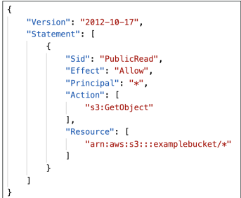
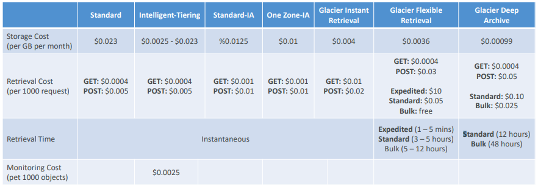
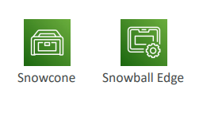

  ## S3

### Section introduction

- Amazon S3 is one of the main building blocks of AWS
- It’s advertised as ”infinitely scaling” storage

- Many websites use Amazon S3 as a backbone
- Many AWS services use Amazon S3 as an integration as well
- We’ll have a step-by-step approach to S3
- The CCP exam requires “deeper” knowledge about S3

### S3 Use cases

- Backup and storage
- Disaster Recovery
- Archive
- Hybrid Cloud storage
- Application hosting
- Media hosting
- Data lakes & big data analytics
- Software delivery
- Static website

### Amazon S3 Overview -Buckets

- Amazon S3 allows people to store objects (files) in “buckets” (directories)
- Buckets must have a globally unique name (across all regions all accounts)
- Buckets are defined at the region level
- S3 looks like a global service but buckets are created in a region
- Naming convention
  - No uppercase
  - No underscore
  - 3-63 characters long
  - Not an IP
  - Must start with lowercase letter or number

### Amazon S3 Overview - Objects

- Objects (files) have a Key
- The key is the FULL path:
  - s3://my-bucket/my_file.txt
  - s3://my-bucket/my_folder1/another_folder/my_file.txt
- The key is composed of prefix + object name
  -ex : s3://my-bucket/my_folder1/another_folder/my_file.txt
- There’s no concept of “directories” within buckets (although the UI will trick you to think otherwise)
- Just keys with very long names that contain slashes (“/”)

- Object values are the content of the body:
- Max Object Size is 5TB (5000GB)
- If uploading more than 5GB, must use “multi-part upload”
- Metadata (list of text key / value pairs – system or user metadata)
- Tags (Unicode key / value pair – up to 10) – useful for security / lifecycle
- Version ID (if versioning is enabled)

### S3 Security

- User based
  - IAM policies - which API calls should be allowed for a specific user from IAM console
- Resource Based
  - which API calls should be allowed for a specific user from IAM console
- Note: an IAM principal can access an S3 object if
  - the user IAM permissions allow it OR the resource policy ALLOWS it
  - AND there’s no explicit DENY
- Encryption: encrypt objects in Amazon S3 using encryption keys

#### Example of S3 security

1. Public Access - Use Bucket Policy

2. User Access to S3 - – IAM permissions

3. EC2 instance access - User IAM roles

4. Advanced: Cross-Account Access – Use Bucket Policy

### S3 Bucket Policies

- JSON based policies
  - Resources: buckets and objects
  - Actions: Set of API to Allow or Deny
  - Effect: Allow / Deny
  - Principal: The account or user to apply the policy to
- Use S3 bucket for policy to:

  - Grant public access to the bucket
  - Force objects to be encrypted at upload
  - Grant access to another account (Cross Account)

  

### Bucket settings for Block Public Access

- These settings were created to prevent company data leaks
- If you know your bucket should never be public, leave these on
- Can be set at the account leve

### S3 Websites Overview

- S3 can host static websites and have them accessible on the www
- The website URL will be:
  - <bucket-name>.s3-website-<AWS-region>.amazonaws.com OR
  - <bucket-name>.s3-website.<AWS-region>.amazonaws.com
- **If you get a 403 (Forbidden) error, make sure the bucket policy allows public reads!**

### S3 Versioning Overview

- You can version your files in Amazon S3
- It is enabled at the bucket level
- Same key overwrite will increment the “version”: 1, 2, 3
- It is best practice to version your buckets
  - Protect against unintended deletes (ability to restore a version)
  - Easy roll back to previous version
- Notes:
  - Any file that is not versioned prior to enabling versioning will have version “null”
  - Suspending versioning does not delete the previous versions

### S3 Access Logs

- For audit purpose, you may want to log all access to S3 buckets
- Any request made to S3, from any account, authorized or denied, will be logged into another S3 bucket
- That data can be analyzed using data analysis tools…
- Very helpful to come down to the root cause of an issue, or audit usage, view suspicious patterns, etc…

- For audit purpose, you may want to log all access to S3buckets
- Any request made to S3, from any account, authorized or denied, will be logged into another S3 bucket
- That data can be analyzed using data analysis tools…
- Very helpful to come down to the root cause of an issue, or audit usage, view suspicious patterns, etc…

### S3 Replication (CRR & SRR)

- Must enable versioning in source and destination
- Cross Region Replication (CRR)
- Same Region Replication (SRR)
- Buckets can be in different accounts
- Copying is asynchronous
- Must give proper IAM permissions to S3
- CRR - Use cases: compliance, lower latency access, replication across accounts
- SRR – Use cases: log aggregation, live replication between production and test accounts

### S3 Storage Classes

- Amazon S3 Standard - General Purpose
- Amazon S3 Standard-Infrequent Access (IA)
- Amazon S3 One Zone-Infrequent Access
- Amazon S3 Glacier Instant Retrieval
- Amazon S3 Glacier Flexible Retrieval
- Amazon S3 Glacier Deep Archive
- Amazon S3 Intelligent Tiering

- Can move between classes manually or using S3 Lifecycle configurations

### S3 Durability and Availability

- Durability:
  - High durability (99.999999999%, 11 9’s) of objects across multiple AZ
  - If you store 10,000,000 objects with Amazon S3, you can on average expect to incur a loss of a single object once every 10,000 years
  - Same for all storage classes
- Availability:
  - Measures how readily available a service is
  - Varies depending on storage class
  - Example: S3 standard has 99.99% availability = not available 53 minutes a year

### S3 Standard - General Purpose

- 99.99% Availability
- Used for frequently accessed data
- Low latency and high throughput
- Sustain 2 concurrent facility failures
- Use Cases: Big Data analytics, mobile & gaming applications, content distribution…

### S3 Storage Classes – Infrequent Access

- For data that is less frequently accessed, but requires rapid access when needed
- Lower cost than S3 Standard

| Amazon S3 Standard-Infrequent Access (S3 Standard-IA) | Amazon S3 One Zone-Infrequent Access (S3 One Zone-IA                                               |
| ----------------------------------------------------- | -------------------------------------------------------------------------------------------------- |
| 99.9% Availability                                    | High durability (99.999999999%) in a single AZ; data lost when AZ is destroyed. 99.5% Availability |
|                                                       |
| Use cases: Disaster Recovery, backups                 | Use Cases: Storing secondary backup copies of on-premise data, or data you can recreate            |

### Amazon S3 Glacier Storage Classes

- Low-cost object storage meant for archiving / backup
- Pricing: price for storage + object retrieval cost

| Amazon S3 Glacier Instant Retrieval                                                                                         | Amazon S3 Glacier Flexible Retrieval (formerly Amazon S3 Glacier)                                                                              | Amazon S3 Glacier Deep Archive – for long term storage                                              |
| --------------------------------------------------------------------------------------------------------------------------- | ---------------------------------------------------------------------------------------------------------------------------------------------- | --------------------------------------------------------------------------------------------------- |
| <ul><li>Millisecond retrieval, great for data accessed once a quarter</li><li>Minimum storage duration of 90 days</li></ul> | <ul><li>Expedited (1 to 5 minutes), Standard (3 to 5 hours), Bulk (5 to 12 hours) – free</li><li>Minimum storage duration of 90 days</li></ul> | <ul><li>Standard (12 hours), Bulk (48 hours)</li><li>Minimum storage duration of 180 days</li><li>Amazon Glacier Deep Archive is the most cost-effective option if you want to archive data and do not have a retrieval time requirement. You can retrieve data in 12 or 48 hours.</li></ul> |

### S3 Intelligent-Tiering

- Small monthly monitoring and auto-tiering fee
- Moves objects automatically between Access Tiers based on usage
- There are no retrieval charges in S3 Intelligent-Tiering

- Frequent Access tier (automatic): default tier
- Infrequent Access tier (automatic): objects not accessed for 30 days
- Archive Instant Access tier (automatic): objects not accessed for 90 days
- Archive Access tier (optional): configurable from 90 days to 700+ days
- Deep Archive Access tier (optional): config. from 180 days to 700+ days

### S3 Object Lock & Glacier Vault Lock

- S3 Object Lock
  - Adopt a WORM (Write Once Read Many) model
  - Block an object version deletion for a specified amount of time
- Glacier Vault Lock
  - Adopt a WORM (Write Once ReadMany) model
  - Lock the policy for future edits (can no longer be changed)
  - Helpful for compliance and data retention

### S3 Encryption

- No Encryption
- Server-side Encryption
- Client-side Encryption

### Shared Rresponsibility Model for s3

| AWS | USER |
| --- | ---- |
| <ul><li>Infrastructure (global security,durability, availability, sustainconcurrent loss of data in two facilities) </li><li>Configuration and vulnerability analysis</li><li>Compliance validation</li></ul>   | <ul><li>S3 Versioning</li><li>S3 Bucket Policies</li><li>S3 Replication Setup</li><li> Logging and Monitoring</li><li>S3 Storage Classes</li><li>Data encryption at rest and in transit</li></ul>    |

### AWS Snow Family

- Highly-secure, portable devices to collect and process data at the edge, and migrate data into and out of AWS
- Data migration:
  - Snowcone
  - Snowball Edge
  - Snowmobile

- Edge Computing:
- Snowcone
- Snowball Edge
  

### Why use Data Migration with AWS Snow Family

- Challenges:
  - Limited connectivity
  - Limited bandwidth
  - High network cost
  - Shared bandwidth (can’t maximize the line)
  - Connection stability

- That's when AWS Sow Family comes in: **offline devices to perform data migrations**
- If it takes more than a week to transfer over the network, use Snowball devices!

#### Diagrams

### Snowball Edge (for data transfers)
- Physical data transport solution: move TBs or PBs of data in or out of AWS
- Alternative to moving data over the network (and paying network fees)
- Pay per data transfer job
- Provide block storage and Amazon S3-compatible object storage
- Snowball Edge Storage Optimized  
  - 80 TB of HDD capacity for block volume and S3 compatible object storage
- Snowball Edge Compute Optimized  
  - 42 TB of HDD capacity for block volume and S3 compatible object storage
- Use cases: large data cloud migrations, DC decommission, disaster recovery

### AWS Snowcone
- Small, portable computing, anywhere, rugged & secure, withstands harsh environments
- Light (4.5 pounds, 2.1 kg) • Device used for edge computing, storage, and data transfer
- 8 TBs of usable storage 
- Use Snowcone where Snowball does not fit (space-constrained environment)
-  Must provide your own battery / cables 
- Can be sent back to AWS offline, or connect it to internet and use AWS DataSync to send data

### AWS Snowmobile ( like a truck)
- Transfer exabytes of data (1 EB = 1,000 PB = 1,000,000 TBs)
- Each Snowmobile has 100 PB of capacity (use multiple in parallel)
- High security: temperature controlled, GPS, 24/7 video surveillance
- Better than Snowball if you transfer more than 10 PB

### Snow Family – Usage Process
1. Request Snowball devices from the AWS console for delivery
2. Install the snowball client / AWS OpsHub on your servers
3. Connect the snowball to your servers and copy files using the client
4. Ship back the device when you’re done (goes to the right AWS facility)
5. Data will be loaded into an S3 bucket
6. Snowball is completely wiped

### What is Edge Computing
- Process data while it’s being created on an edge location (no access to internet)
  - Ex: A truck on the road, a ship on the sea, a mining station underground... 
- These locations may have
  - Limited / no internet access
  - Limited / no easy access to computing power
- We setup a Snowball Edge / Snowcone device to do edge computing
- Use cases of Edge Computing:
  - Preprocess data
  - Machine learning at the edge
  - Transcoding media streams
- Eventually (if need be) we can ship back the device to AWS (for transferring data for example)

### Snow Family – Edge Computing 
- Snowcone (smaller)
  - 2 CPUs, 4 GB of memory, wired or wireless access
  - USB-C power using a cord or the optional battery
- Snowball Edge – Compute Optimized
  - 52 vCPUs, 208 GiB of RAM
  - Optional GPU (useful for video processing or machine learning)
  - 42 TB usable storage
- Snowball Edge – Storage Optimized
  - Up to 40 vCPUs, 80 GiB of RAM
  - Object storage clustering available
- All: Can run EC2 Instances & AWS Lambda functions (using AWS IoT Greengrass)
- Long-term deployment options: 1 and 3 years discounted pricing

### AWS OpsHub
- Historically, to use Snow Family devices, you needed a CLI (Command Line Interface tool)
- Today, you can use AWS OpsHub (a software you install on your computer / laptop) to manage your Snow Family Device
  - Unlocking and configuring single or clustered devices
  - Transferring files
  - Launching and managing instances running on Snow
  Family Devices
  - Monitor device metrics (storage capacity, active
  instances on your device)
  - Launch compatible AWS services on your devices
  (ex: Amazon EC2 instances, AWS DataSync, Network File System (NFS))

### Hybrid Cloud for Storage
- AWS is pushing for ”hybrid cloud”
 - Part of your infrastructure is on-premises
 - Part of your infrastructure is on the cloud
- This can be due to 
  - Long cloud migrations
  - Security requirements
  - Compliance requirements
  - IT strategy
- S3 is a proprietary storage technology (unlike EFS / NFS), so how do you expose the S3 data on-premise?
- AWS Storage Gateway!

### AWS Storage Cloud Native Options

### AWS Storage Gateway
- Bridge between on-premise data and cloud data in S3
- Hybrid storage service to allow on- premises to seamlessly use the AWS Cloud
- Use cases: disaster recovery, backup & restore, tiered storage
- Types of Storage Gateway:
  - File Gateway
  - Volume Gateway
  - Tape Gateway
- No need to know the types at the exam

### AWS S3- Summary
- Buckets vs Objects: global unique name, tied to a region
- S3 security: IAM policy, S3 Bucket Policy (public access), S3 Encryption
- S3 Websites: host a static website on Amazon S3
- S3 Versioning: multiple versions for files, prevent accidental deletes
- S3 Access Logs: log requests made within your S3 bucket
- S3 Replication: same-region or cross-region, must enable versioning
- S3 Storage Classes: Standard, IA, 1Z-IA, Intelligent, Glacier, Glacier Deep Archive
- S3 Lifecycle Rules: transition objects between classes
- S3 Glacier Vault Lock / S3 Object Lock: WORM (Write Once Read Many)
- Snow Family: import data onto S3 through a physical device, edge computing
- OpsHub: desktop application to manage Snow Family devices
- Storage Gateway: hybrid solution to extend on-premises storage to S3