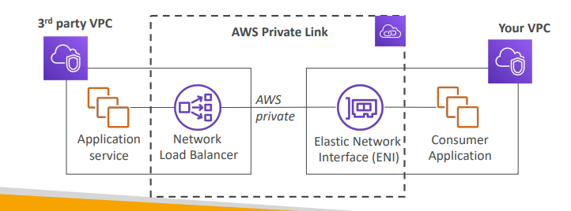

## VPC – Crash Course
- No need to know in-depth for CCP

- At the AWS Certified Cloud Practitioner Level, you should know about:
  - VPC, Subnets, Internet Gateways & NAT Gateways
  - Security Groups, Network ACL (NACL), VPC Flow Logs
  - VPC Peering, VPC Endpoints
  - Site to Site VPN & Direct Connect
  - Transit Gateway
- I will just give you an overview, less than 1 or 2 questions at your exam.
- We’ll have a look at the “default VPC” (created by default by AWS for you)

# VPC & Subnets Primer
- **VPC -Virtual Private Cloud**: private network to deploy your resources (regional resource)
- **Subnets** allow you to partition your network inside your VPC (Availability Zone resource)
-  A **public subnet** is a subnet that is accessible from the internet
- A **private subnet** is a subnet that is not accessible from the internet
- To define access to the internet and between subnets, we use **Route Tables**

## VPC Diagram

## Internet Gateway & NAT Gateways
- Internet Gateways helps our VPC instances connect with the internet
- Public Subnets have a route to the internet gateway.
- NAT Gateways (AWS-managed) & NAT Instances (self-managed) allow your instances in your **Private Subnets** to access the internet while remaining private

## Network ACL & Security Groups

|NACL (Network ACL)|Security Groups|
|------------------|---------------|
|<ul><li>A firewall which controls traffic from and to subnet</li><li>Can have ALLOW and DENY rules</li><li>Are attached at the <b>Subnet</b> level</li><li>Rules only include IP addresses</li></ul> | <ul><li>A firewall that controls traffic to and from an **ENI / an EC2** Instance</li><li>Can have only ALLOW rules</li><li>Rules include IP addresses and other security groups</li></ul>|

## Network ACLs vs Security Groups

## VPC Flow Logs
- Capture information about IP traffic going into your interfaces:
  - **VPC** Flow Logs
  - **Subnet** Flow Logs
  - **Elastic** Network Interface Flow Logs
- Helps to monitor & troubleshoot connectivity issues. Example:
  - Subnets to internet
  - Subnets to subnets
  - Internet to subnets
- Captures network information from AWS managed interfaces too: Elastic, Load Balancers, ElastiCache, RDS, Aurora, etc…
- VPC Flow logs data can go to S3 / CloudWatch Logs

## VPC Peering
- Connect two VPC, privately using AWS’ network
- Make them behave as if they were in the same network
- Must not have overlapping CIDR (IP address range)
- VPC Peering connection is **not transitive** (must be established for each VPC that need to communicate with one another

## VPC Endpoints
- Endpoints allow you to connect to AWS Services **using a private network** instead of the public www network
- This gives you enhanced security and lower latency to access AWS services
- VPC Endpoint **Gateway**: S3 & DynamoDB
- VPC Endpoint **Interface**: the res

## AWS PrivateLink
- Most secure & scalable way to expose a service to 1000s of VPCs
- Does not require VPC peering, internet gateway, NAT, route tables…
- Requires a network load balancer (Service VPC) and ENI (Customer VPC)

## Site to Site VPN & Direct Connect

|Site to Site VPN| Direct Connect (DX) |
|------------------|---------------|
|<ul><li>Connect an on-premises VPN to AWS</li><li>The connection is automatically encrypted</li><li>Goes over the public internet</li></ul> | <ul><li>Establish a physical connection between
on-premises and AWS</li><li>The connection is private, secure and fast</li><li>Goes over a private network</li><li>Takes at least a month to establish</li></ul>|

### Site-to-site VPN
- On-premises: must use a Customer Gateway (CGW)
- AWS: must use a Virtual Private Gateway (VGW)

## AWS Client VPN
- Connect from your computer using OpenVPN to your private network in AWS and on-premises
- Allow you to connect to your EC2 instances over a private IP (just as if you were in the private VPC network)
- Goes over **public Internet**

## Network topologies can become complicated

## Transit Gateway
- For having transitive peering between thousands of VPC and on- premises, hub-and-spoke (star) connection
- One single Gateway to provide this functionality
- Works with Direct Connect Gateway, VPN connections

## VPC Summary
VPC: Virtual Private Cloud
- Subnets:Tied to an AZ, network partition of the VPC
- Internet Gateway: at the VPC level, provide Internet Access
- NAT Gateway / Instances: give internet access to private subnets
- NACL: Stateless, subnet rules for inbound and outbound
- Security Groups: Stateful, operate at the EC2 instance level or ENI
- VPC Peering: Connect two VPC with non overlapping IP ranges, nontransitive VPC Endpoints: Provide private access to AWS Services within VPC
- PrivateLink: Privately connect to a service in a 3rd party VPC
- VPC Flow Logs: network traffic logs
- Site to Site VPN: VPN over public internet between on-premises DC and AWS
- Client VPN: OpenVPN connection from your computer into your VPC
- Direct Connect: direct private connection to AWS
- Transit Gateway: Connect thousands of VPC and on-premises networks together
